:doctype: book
:sectnums:
:sectnumlevels: 5
:toc:
:toclevels: 4

:title-page-background-image: image::images/front_cover.jpg[scaledwidth=50%]

= JWildfire users manual
Copyright (C) 2021 by Andreas Maschke

== Introduction
[.thumb]
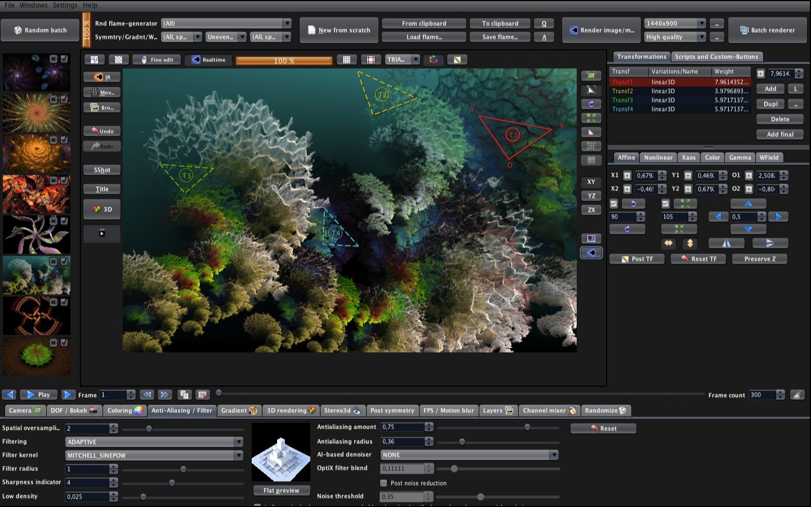

Welcome to JWildfire and this user manual!

The goal of this book is to describe the numerous functions of the software and to explain how they work.
After over 10 years of development there are many functions,
so the book is more a reference book rather than one you might read from start to end.

This book does not attempt to teach you how to create fractals, and it does not include
any practice materials or examples. That would be too much for this manual and will be
part of a kind of "workbook" that I have plans to write.

Anyway, I'm hoping this book will help you to have more fun with the software and achieve
the results you are looking for.

Have fun!

Andreas Maschke, Grambek (Germany) 2021

=== Acknowledgement
Thanks to Brad Stefanov, D. Aaron Sawyer, Nancy Pierce, my wife Patricia Maschke, and Rick Sidwell for their valuable
comments and suggestions for improving this document.

Thanks to the whole fractal art community for their never-ending enthusiasm which always pushes me forward.

[#main_menu]
== _Main_ menu
After launching the program the <<fractal_flame_editor, Fractal-Flame Editor>> is opened automatically,
because it is the main module of JWildfire.
There are additional modules and useful functions which can be reached from the _Main_ menu.

The _Main_ menu contains the following items:

 - *File*: some file-related functions
 ** *Open flame*: open a flame-file to be edited in the <<fractal_flame_editor, Fractal-Flame Editor>>
 ** *Open image*: open an image-file and display it in a separate window
 ** *Quit JWildfire*: quits the program

 - *Window*: to open/close the various modules of JWildfire (An opened module is indicated by a small checkmark left of the menu item. If it is not visible it might be in background.)
 ** *Fractal flames: Editor*: open the <<fractal_flame_editor, Fractal-Flame Editor>>
 ** *Fractal flames: MutaGen*: open the <<mutagen_module, MutaGen>> module
 ** *Fractal flames: Interactive renderer*: open the <<interactive_renderer_module, Interactive renderer>>
 ** *Fractal flames: Flame browser*: open the <<flame_browser_module, Flame browser>>
 ** *Fractal flames: Easy movie maker*: open the <<easy_movie_maker_module, Easy Movie Maker>>
 ** *Fractal flames: Dancing flames*: open the <<dancing_flames_module, Dancing flames>> module
 ** *Fractal flames: Batch renderer*: open the <<batch_renderer, Batch renderer>>
 ** *Fractal flames: Quilt renderer*: open the <<quilt_renderer, Quilt renderer>>
 ** *Fractal flames: Mesh generator*: open the <<mesh_generator, Mesh generator>>
 ** *Fractal flames: GPU render*: open the <<gpu_rendering, GPU renderer>>
 ** *Fractal flames: Help*: open a popup which displays some helpful information regarding fractal flame
 ** *IFlames*: open the <<iflames_module, IFlames>> module
 ** *Image processing*: open a popup which offers some image-processing possibilities. Goes back to the old Amiga days.
 ** *Formula explorer*: open a popup which contains a simple function plotter
- *Settings*: options to customize the program
 ** *UI Theme (Look and Feel)*: open a popup to change the UI theme of the whole program
 ** *Preferences*: open the <<preferences, _Preferences_>>-window
 ** *Startup settings (Steam)*: only available in the _Steam version_: opens a window to edit the <<jvm_startup_parameters, Startup options>> for the _Steam Edition_ of JWildfire

 - *Help*: some useful information and the official documentation
 ** *User manual*: the official user manual (the file you are currently reading)
 ** *System information*: opens a popup to display some useful information about your system relating  to JWildfire, for example, available memory
 ** *Welcome to JWildfire*: an ancient Welcome-dialog with some useful links, not available in the _Steam Edition_ of JWildfire
 ** *List of changes*: displays the ever growing list of changes. It is a recommended read after each release of the software.
 ** *Message log*: displays a log of all (error)messages which occured during the current session. You may also find a copy of these messages in the file JWildfire.log in your home folder.
 ** *GPU rendering*: some compact documentation about <<gpu_rendering, GPU-rendering>>
 ** *Supported AI-Post-Denoisers*: some compact documentation about <<ai_based_denoiser, _AI-based denoisers_>>
 ** *Tip of the day*: a small popup which shows small tips at the startup of JWildfire

[#fractal_flame_editor]
== Fractal-Flame Editor
[.thumb]
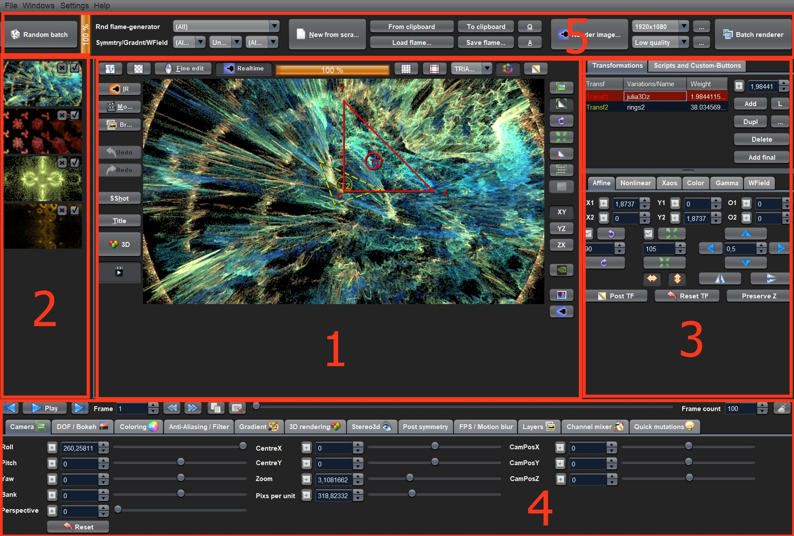
The Fractal-Flame Editor is the heart of JWildfire.
Here you create random flames or fine-tune your artwork.
It consists of the following elements:

. *Preview/Editor Area*
. *Thumbnail ribbon*
. *Transformations and Scripts*
. *Flame settings*
. *Global functions*

You will find a description of each of these elements as a separate sub-chapter in this manual.

Most controls have tool tips; short descriptions that appear when you hover
over them for a second.

=== Preview/Editor area
This area is both for previewing fractals and editing them in realtime.
The most simple and intuitive way to edit a fractal is to drag or rotate one of the
visible controls on top of the fractal (usually in the shape of triangles).
However, there are also many other precise ways to modify a fractal flame.

==== Quick buttons on the top of the preview area
[.thumb]
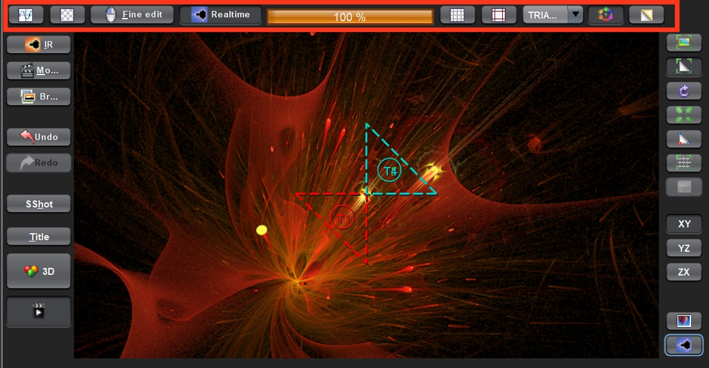

These buttons primarily control the previewing/editing options.

===== _Display/hide variation effect_
Displays the contribution of the currently selected transformation (in the Transformations-area) in the form of a transformed grid.
For example, if the current transformation is a rotation, it will show a rotated grid.
If there are nonlinear transformations (also known as variations or "plugins"),
then the displayed grid may change/deform much more.

===== _Display/hide transparency_
Switch preview-rendering with transparent background on or off.
Please note that this only affects the preview display and not the transparency setting of the flame itself.

===== _Fine edit_
Turn on or off "fine editing". Fine editing means that changes are less sensitive to the mouse
or touchpad which allows for editing with a higher level of detail.

[#realtime_preview]
===== _Realtime_
Turns progressive rendering of the preview on or off. Progressive rendering means
that the image starts to render in very low quality and improves with time.
Usually this works well, and allows for fluid editing.
On slower machines (for example notebooks), this may cause a heavy load, and on some fractals it may cause flickering.
Turning it off will produce a render preview of a lower (non-progressive) quality.

===== _Progress bar_
The progress bar indicates the current render progress in the following cases:

- refreshing the _Preview_ by using the <<render_preview, _Render image preview_>> button
- rendering an image or movie by using <<render_image_movie, _Render image/movie_>> button

===== _Turn grid on/off_
Turns on or off a grid which may help to align controls. Note that this grid can be
moved (see <<edit_view_of_controls, _Edit view of the controls_>>), so is intended for control alignment, not image alignment.

===== _Turn guides on/off_
Turns on or off "artistic guides" for

- *center point*
- *rule of thirds*
- *golden ratio*

which may help to find the right camera position/view.

===== _Style of editor controls_
You may select one of the following styles of editor-controls:

- *axis*
- *crosshair*
- *rectangle*
- *triangle* (default)
- *hidden*

===== _Toggle monochrome/colored controls_
Per default, each control is drawn in its own color to make it more distinguishable.
Sometimes this may distract you from the fractal. Using this option, you may switch
to a less intrusive monochrome display of controls.

[#post_transform]
===== _Toggle post transform_
Quick-switch to toggle between editing of the affine-post-transform and the regular affine transform.

Longer explanation: Transformations are executed in the following order:

. *affine transform*
. *nonlinear transforms*
. *affine post-transform*

In the preview area you may either edit the affine transform or the post-affine-transform
by moving the visual controls with the mouse or touchpad.
This button allows you to switch easily between these two options.

==== Quick buttons on the right of the preview area
[.thumb]
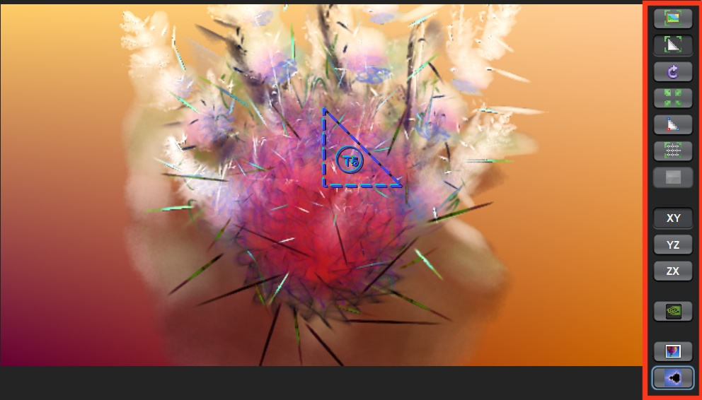
These buttons primarily control the type of editing and refreshing the preview.

===== _Enable view editing mode_
In this mode you change the camera settings (view) when dragging the mouse.

- using the mouse-wheel, you may zoom in/out.
- by dragging the mouse with the left mouse-button pressed, you move the camera.
- by dragging the mouse right or left with the right mouse-button pressed, you rotate the camera.

===== _Move triangles mode_
In this mode you edit the affine or post-affine transformation when dragging the mouse.

- using the mouse-wheel, you may scale up/down.
- by dragging the mouse with the left mouse-button pressed, you move the control, causing a translation
- by dragging the mouse right or left with the right mouse-button pressed, you rotate the control, causing a rotation.

===== _Rotate triangles mode_
This mode is similar to _Move triangles mode_, but you are restricted to rotations.
The rotation is done by dragging the mouse right or left while pressing the left mouse-button.

===== _Scale triangles mode_
This mode is similar to _Move triangles mode_, but you are restricted to scale up/down.
This operation is done by dragging the mouse right or left while pressing the left mouse-button.

===== _Enable free point editing_
In this mode you may freely edit the affine transform by dragging the three corner points
of the triangle-controls.
This way you can easily create a free combination of translation, rotation and shear.

[#edit_view_of_controls]
===== _Edit view of the controls_
In this mode you edit the appearance of the controls. This doesn't change the flame;
only how the controls look. It can be used to see controls that are outside the window
by moving them or scaling them down. It also controls how sensitive the controls are;
scale them up for finer placement.

- using the mouse-wheel, or by dragging the mouse left or right with the right mouse-button pressed, you may scale them up/down.
- by dragging the mouse with the left mouse-button pressed, you move the controls

See "Turn grid on/off" above.

[#edit_focus_point]
===== _Edit focus point_
Edit the focus-point (parameters FocusX, FocusY and FocusZ at
the <<dof_bokeh_tab, "DOF/Bokeh -> DOF" - tab>>) using the mouse.

- by dragging the mouse with the left mouse-button pressed, you change FocusX- and FocusY-parameters
- using the mouse-wheel you change the FocusZ-parameter

===== _Affine XY edit plane_
Sets the current editing-plane for editing affine-transform to the x-y-plane.

The editing of affine-transforms takes place in one plane, the default setting is the x-y-plane.
When editing "classic" 2d-fractals, the x-y-plane is the only plane.
But, when editing 3d-fractals, you may choose different planes, in order to modify all three coordinates.

===== _Affine YZ edit plane_
Sets the current editing-plane for editing affine-transform to the y-z-plane.

===== _Affine ZX edit plane_
Sets the current editing-plane for editing affine-transform to the z-x-plane.

===== _AI Denoiser preview_
Apply the currently selected AI denoiser (OptiX or OIDN) and display it in the preview.
This function uses a split preview, in order to allow you to compare the denoised and the original image.
On the left side, you see the original image, on the right side of the split indicator you
see the denoised image.
This button only appears if an AI denoiser is selected in the <<anti_aliasing_filter_tab, Anti-Aliasing/Filter tab>>.

This function uses the current preview. So it is recommended to re-render the preview in
higher quality before invoking it.

===== _External render preview_
Open an additional detached progressive preview; works especially well when you are using two monitors.

[#render_preview]
===== _Render image preview_
Re-renders the current preview with a much higher quality level.

This can take some time. The progress bar on the top of the preview area shows the preview progress.
If solid rendering is enabled, there will be a short delay after the progress bar reaches 100%
before the result is displayed.

This is a very important function in the fractal-editing workflow, because certain parameter changes
do not cause a complete re-render of the image, as this would be too slow.
Instead, after such parameter changes, a raw in-memory version of the last preview
to which the parameter change is applied is used.

This is especially helpful when progressive rendering is off (see the _Realtime_ button), where the
preview has very low quality.

Therefore, when fine-tuning colors, it is recommended to re-render the preview in higher quality
using this button before changing the settings.
Because this function is of such importance, is has been placed in a prominent place.

==== Quick buttons on the left of the preview area
[.thumb]
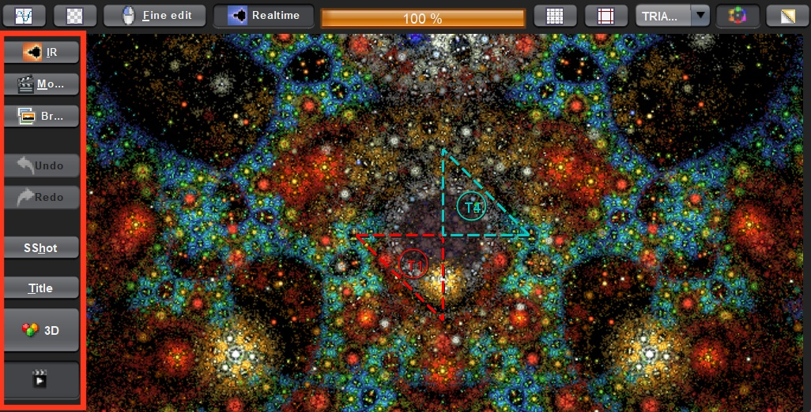
In this area you find some quick-buttons to reach other modules of JWildfire and the Undo/Redo-buttons.

===== _Interactive renderer_
This is a shortcut for the <<interactive_renderer_module, Interactive Renderer>>.
It opens the <<interactive_renderer_module, Interactive Renderer>> or brings it into the foreground.
It serves no other function, and won't for example, load the current flame into the <<interactive_renderer_module, Interactive Renderer>>.
This was intentional.

===== _Easy Movie Maker_
Opens the <<easy_movie_maker_module, Easy Movie Maker>>.
Automatically adds the currently loaded flame as the first keyframe inside the Easy Movie Maker.

===== _Flame Browser_
Opens the <<flame_browser_module, Flame Browser>>.

===== _GPU render_
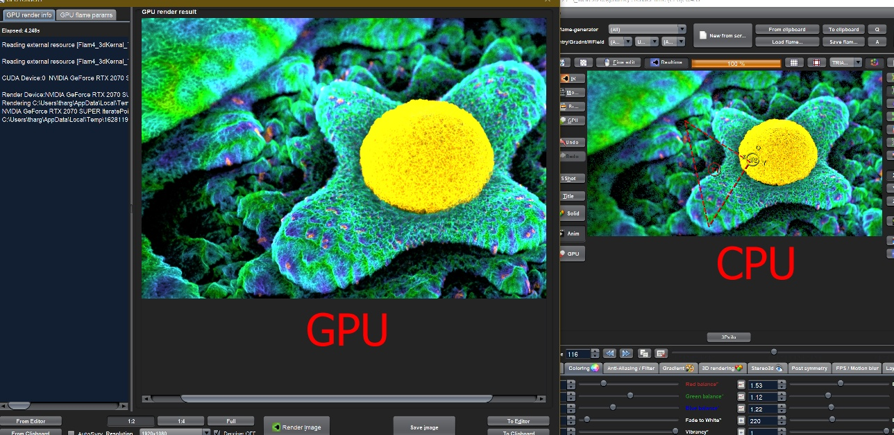

Opens the <<gpu_rendering, GPU render module>>.
Automatically imports the currently selected flame into the <<gpu_rendering, GPU render module>>
and starts to render the flame.

===== _Undo_
Reverts the latest change to the currently selected flame.
Each flame has its own undo-history. So undoing a change will not switch between flames.

Please note, that the undo history is not saved together with flames, so it is lost when
you quit JWildfire.

===== _Redo_
Repeats the latest undone change to the currently selected flame.

===== _SShot (Snapshot)_
Create a snapshot of the current flame. This is an identical copy with new undo-history.

===== _Title_
Sets the title of the current flame. This is a good place to also put copyright information
or to add your name (as the author of the artwork).
You can set a default title for flames which are created using the
<<new_from_scratch, _New from Scratch_>>-button, by setting the
property *tinaDefaultNewFlameTitle* in the <<preferences, _Preferences_>>-window.

===== _Solid_ (formerly named "3D")
Switch between "classic" rendering and solid rendering.

Solid rendering basically works by treating each sample of the fractal flame as a solid particle.
The sum of all of these particles makes up a larger solid shape.
This works only for certain types of flame fractals.
It may fail if the structure is too thin or is in general too "chaotic" or too blurry.
Solid rendering can be used to create really unusual and interesting things.
Here is a render of the "classic" Mandelbulb (thanks to Whittaker Courtney for the idea):

[.thumb]
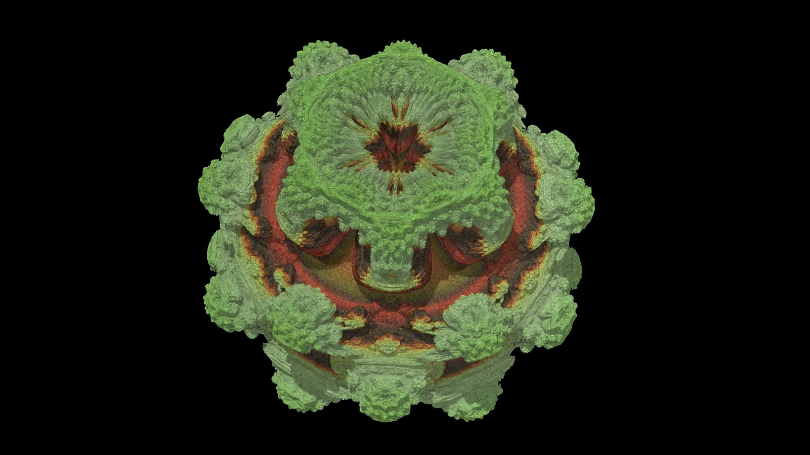

===== _Animations controls on/off_
Using this button you may turn on or off animation controls.
You may set up your preference for this setting in the <<preferences, _Preferences_>>-window.

[#gpu_mode]
===== _GPU-mode on/off_
This button is only available, when <<gpu_rendering, GPU-rendering>> is supported on your system.

It is a switch to turn GPU-mode on or off.

GPU-mode helps you to integrate GPU-rendering into your artistic process.
When activated, it changes the behaviour of JWildfire in the following ways:
 - random-flame-generators try to avoid features which are not supported by GPU-rendering (which uses heuristics and is currently limited)
 - the Render-function of the main-editor automatically uses GPU for rendering (without the need to transfer the flame to
   the separate GPU-renderer-window)
 - the Preview-Render-function (button at the lower right area of the prewiew area) also uses the GPU.
 - there is an implicit GPU-filter for the list of variations, so when creating new fractals you can select only variations which are
supported on GPU

Please note, that the GPU-mode does not affect the real-time-preview, which is used for editing.

You may change the initial state of the GPU-mode by adjusting the
property *tinaGpuModeDefaultEnabled* in the <<preferences, _Preferences_>>-window.

=== _Thumbnail ribbon_
[.thumb]
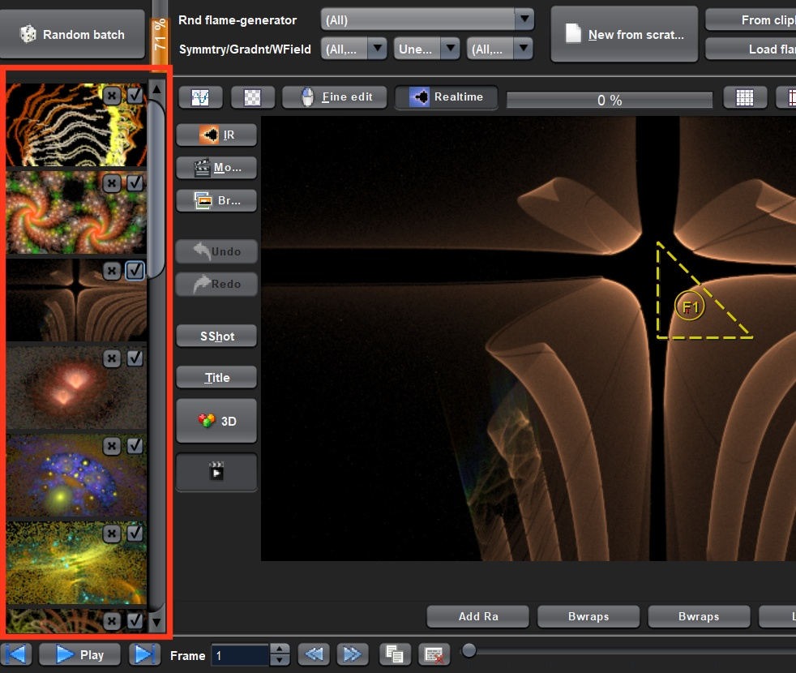

The thumbnail ribbon holds thumbnails of all the flames you currently are editing.
After starting the program, some random flames are generated and displayed in the thumbnail ribbon.

You can edit/view any flame of the thumbnail by just double-clicking (or right-clicking) on it.

If you want to return to a previous flame, just double-click the thumbnail of the other flame.
Each flame in the thumbnail-ribbon has its own undo-history.

[#selecting_flames_thumbnail_ribbon]
==== Selecting flames in the _thumbnail ribbon_
Each flame in the _thumbnail ribbon_ has a little checkbox assigned in the upper right corner.
By changing the value of this checkbox you change the selected state of the thumbnail.

Selection of individual flames is only important for saving and deleting.

[.thumb]
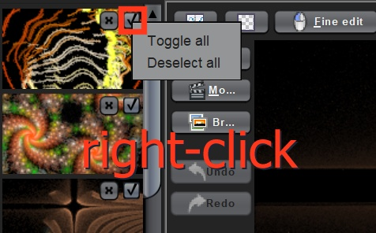

By pressing the right mouse-button on top of this checkbox you can open a pop-up menu
to change the selection for all flames inside the _thumbnail ribbon_:

 - *Toggle all*: invert the selection of all flames
 - *Deselect all*: set all flames to deselected state

So, one way to select all flames is to deselect them all and then to invert the selection.

==== Deleting flames in the _thumbnail ribbon_
Each flame in the _thumbnail ribbon_ has also a little delete-button assigned in the upper right corner.
By pressing this button you may delete the corresponding flame from the _thumbnail ribbon_.
Since this can not be undone, a popup will appear to confirm the action.

[.thumb]
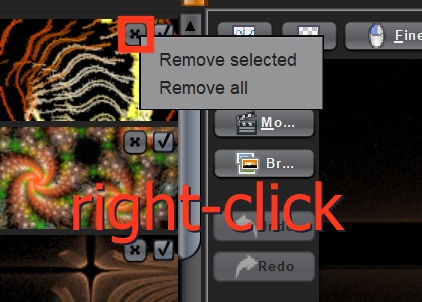

By pressing the right mouse-button on top of this button you can open a pop-up menu
to delete a number of flames from the _thumbnail ribbon_:

- *Remove selected*: delete all flames which are selected (the corresponding checkbox is checked)
from the _thumbnail ribbon_
- *Remove all*: empty the _thumbnail ribbon_

=== Flame settings
At this main tab, you may edit settings at the fractal-flame-level. Most of these settings will
affect the final outcome in a global way, but do not affect the structure of the fractal itself.
For example, you can change the view-settings or the final coloring, but not the shape itself or
which details are computed.

==== _Camera_ tab
[.thumb]
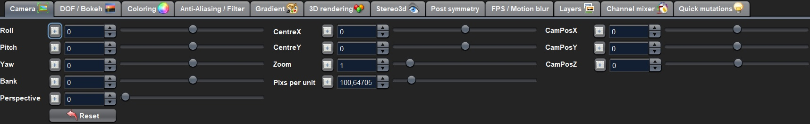

With these controls you can control the camera-view. You can rotate and move the camera freely and zoom in/out.

"Classic" flame fractals are flat (2D); they have no depth.
Basically the parameters Roll, CentreX, CentreY and Zoom/Pixels per unit apply to them.
For 3D fractals there are a lot more controls.

But, you can "mix" them, of course. So you can apply all parameters to any fractal and also rotate a 2D flame in space or apply a perspective distortion to it.

===== _Roll_
Camera roll angle in degrees. Rotates around the virtual z-axis and also applies to 2D fractals.

===== _Pitch_
Flame pitch angle in degrees. Rotates the flame around its x-axis.

===== _Yaw_
Flame yaw angle in degrees. Rotates the flame around its z-axis.

===== _Bank_
Flame bank angle in degrees. Rotates the flame around its y-axis.

===== _Perspective_
Camera perspective. A value of 0 indicates no perspective, while higher values produce more dramatic perspective effects. Values can be negative for more interesting effects.

===== _CentreX_
Offset (translation) of the fractal x-direction.

===== _CentreY_
Offset (translation) of the fractal y-direction.

===== _Zoom_
Camera zoom.

===== _Pixels per unit_
Another (classic) measure of zoom. "Pixels per unit" means how many pixels are needed to fill a numerical
distance of 1.0 (in fractal coordinates). The higher the value, the more details (like zooming in).

===== _CamPosX_
Position of the camera in x-direction. Has an effect similar to CentreX for 2D fractals, but a different effect for 3D-fractals.

===== _CamPosY_
Position of the camera in y-direction. Has an effect similar to CentreY for 2D fractals, but a different effect for 3D-fractals.

===== _CamPosZ_
Position of the camera in z-direction.

[#dof_bokeh_tab]
==== _DOF/Bokeh_ tab
DOF (Depth Of Field) is the blurring of parts of the flame based on the distance from the camera.
Whether to use it is a personal decision. Some people like it a lot (including myself),
some people do not like it at all. So, this sub-chapter describes a rather "special" topic.
Bokeh refers to the shape of out-of-focus points of light in a real camera.
JWildfire can simulate some bokeh effects in conjunction with DOF.

===== _DOF_ subtab
[.thumb]
image::images/dof_tab.jpg[scaledwidth=75%]

This tab contains some of the more basic settings regarding to DOF.

====== _New DOF_
Switches between classic and more sophisticated (new) DOF modes.
Usually, the "new mode" is recommended. The classic mode is still there because of backwards compatibility.

====== _Amount_
Amount of DOF. A value of zero means no DOF at all.

====== _Area_
Measure of the sharp area around the focus point.

====== _Exponent_
Measure of the falloff of the sharp area around the focus point.

====== _Camera dist_
Only applies to the classic mode and is a measure of the distance from the camera to the focus point.

====== _FocusX_
X-position of the focus point (a point which is sharp). May also be edited interactively in the preview area
(use the <<edit_focus_point, _Edit focus point_>> button).

====== _FocusY_
Y-position of the focus point (a point which is sharp). May also be edited interactively in the preview area
(use the <<edit_focus_point, _Edit focus point_>> button).

====== _FocusZ_
Z-position of the focus point (a point which is sharp). May also be edited interactively in the preview area
(use the <<edit_focus_point, _Edit focus point_>> button).

===== _Bokeh_ subtab
At this tab you can select options to create bokeh-like styles of DOF-effects.
These options are not available when using solid rendering. For solid rendering there is an option to
apply post-bokeh effects, but these are limited in comparison to the options you find at this tab.

====== _Shape_
Selects the shape of the bokeh-effect

- *Bubble*: the typical and default shape
- *Cannabiscurve*: some nice-looking organic shapes
- *Cloverleaf*
- *Flower*
- *Heart*: little hearts, makes nice Valentine-cards
- *NBlur*: has some interesting options to create very different shapes
- *Perlin Noise*: an unusual but interesting style
- *Rect*: very simple but effective style. You can also create "rain"-like scenes with this
- *SineBlur*: a popular circular bokeh
- *StarBlur*: tiny stars
- *Taurus*: another unusual but interesting shape
- *Snowflake*: a complex snowflake, created with the algorithm described in the
paper "A local cellular model for snow crystal growth" by Clifford A. Reiter.
- *SubFlame*: This is the most versatile option: you may use any other fractal as bokeh-style.

====== _Scale_
Global scale of the bokeh-shapes.

====== _Rotate_
Global rotation-angle of the bokeh-shapes.

====== _Fade_
Global falloff of the bokeh-shapes.

====== _Shape specific parameters_
Depending on the bokeh-shape, there are additional parameters.
Most of them are the same as in the variation of the same name. For example, the "Taurus"-bokeh-style has a
parameter N (which is the number of corners). The "taurus"-variation has the same parameter.
Not all parameters of a variation are exposed to the bokeh-style of the same name.

====== Flame (for the Sub-Flame-bokeh-style)
This parameter selects the flame you want to use as bokeh-style.
It is a number, starting at 1. Before you can use a flame as bokeh-style, you must save it to your default
flame-folder by using a filename in the form *"_dof_XXXX.flame"*, where XXXX corresponds to the number
you select here.
For example, when you enter "23" as parameter flame, JWildfire will look for a flame-file with the
filename *_dof_0023.flame*.

===== _Post bokeh_ subtab
[.thumb]
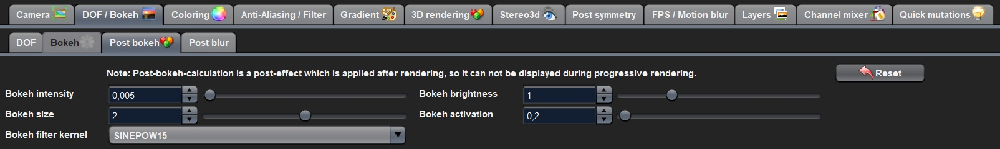
At this tab you can select options to create bokeh-like effects when using solid rendering.
These options are only available in solid rendering and are limited to the bokeh-related options
which are available for regular flames.

====== _Bokeh intensity_
Overall amount/intensity of bokeh-effects.

====== _Bokeh size_
Size of the bokeh-effects. The larger the effect, the more computation time is required.

====== _Bokeh filter kernel_
Type of bokeh-shape. The default setting produces "classic" flat circular shapes.

====== _Bokeh brightness_
Intensity of the bokeh in comparison the the original image.

====== _Bokeh activation_
Intensity level of the original image for placing bokeh "seeds". The larger the value, the more seeds and the more bokeh.

===== _Post blur_ subtab
[.thumb]
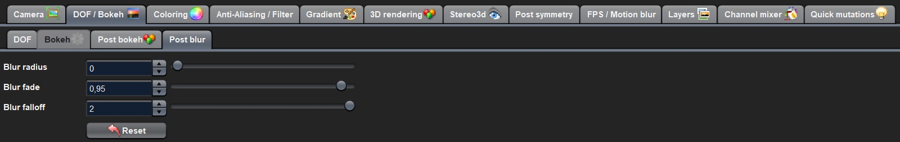

Post-blur is not technically a DOF-effect, but it creates a type of blur, therefore it is located at this tab.
It is not a popular option and primarily resides here for backwards compatibility.

Post-blur works by smudging each rendered sample of the fractal flame.
The effect diminishes with distance to center. It usually makes a fractal appear more bold and "glassy".

====== _Blur radius_
Radius of the blur.

====== _Blur fade_
(Inverse) intensity of the blur. The maximum value means maximum fade out, or no blur effect at all.

====== _Blur falloff_
Strength of diminishing of the effect dependent of the distance to the center of the individual sample.

==== _Coloring_ tab
[.thumb]
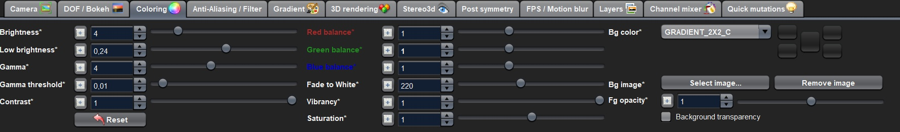
At this tab you may edit numerous coloring/tonemapping options to turn your fractals into real artworks.

===== _Brightness_
Overall brightness level of the rendered image. For some fractals even very high values (above 20) may work nicely.

===== _Low brightness_
A tool to increase the brightness of areas with low sampling density. May help to reveal background details
of the fractals which would otherwise be hidden.

===== _Gamma_
Gamma correction level. Small values (below 2.5) increase the brightness of already bright areas and darken
already dark areas, causing a kind of glowing effect.

===== _Gamma threshold_
A density-threshold defining when to apply the gamma correction. In areas with a density below the
threshold a linear transformation is applied, while at areas with higher density the actual gamma
correction is applied. Playing with this value may also help to increase details of areas with low density.

===== _Contrast_
Overall contrast level of the fractal per default maximum contrast. In the most cases it should not be
necessary to alter this value, because lowering the contrast usually leads to less appealing images.

===== _Red balance_
Overall red balance of the image. A convenient option for fine-tuning the final result without the
need to change the gradient.

===== _Green balance_
Overall green balance of the image. A convenient option for fine-tuning the final result without the
need to change the gradient.

===== _Blue balance_
Overall blue balance of the image. A convenient option for fine-tuning the final result without the
need to change the gradient.

===== _Fade to White_
A measure for the saturation-level of final colors. It can be used to achieve glowing-effects (decrease the value)
or to reduced glowing and make more details visible (increase the value).
Works similar to the gamma-value.

===== _Vibrancy_
Overall vibrancy-level (measurement of the number of different color values). Per default set to the maximum value,
which is very typical for fractal rendering.

===== _Saturation_
Saturation-level of the colors. A convenient option for fine-tuning the final result without the
need to change the gradient.

===== _Bg color_
Background-color which is mixed with the fractal in the foreground to create a smooth looking final result.
The options are:

- *Single color*: one single color for the whole background
- *Gradient 2x2*: create a background by blending 4 colors at the corners of a rectangle
- *Gradient 2x2_c*: create a background by blending 4 colors at the corners of a rectangle and one color at the center

===== _Bg image_
Background image which is mixed with the fractal in the foreground to create a smooth looking final result.
Please note that a background image has higher priority than a background color.
Therefore, if the background image and the background color are chosen, only the background image is rendered.

===== _Fg opacity_
Mixing-level of the foreground (fractal) when applying a background color or background image.
Lower values make the foreground less transparent, but may increase antialiasing effects.

===== _Background transparency_
Turns rendering with transparent background (alpha channel) on or off. This option is usually used when you
want to use your fractal images inside other software packages like Adobe Photoshop to compose a final
artwork out of different images or parts.
Please note that you may also activate a preview of the background-transparency in
JWildfire (in the top area of the preview-window).

[#anti_aliasing_filter_tab]
==== _Anti-Aliasing/Filter_ tab
[.thumb]
image::images/antialiasing_tab.jpg[scaledwidth=75%]
At this tab you find some very important settings which help to improve the visual quality or "cleanliness"
of your fractal artworks.
For details about filtering see the sub-section <<how_filtering_works, _Filter kernel preview/How filtering works_>>.

===== _Spatial oversampling_
Factor of spatial oversampling. Spatial oversampling works by internally rendering an image of a larger size
and then creating a final of (usually) better quality by taking all this additional information into account.

 - a value of 1 means no spatial oversampling
 - a value of 2 means rendering internally an image of double size (double the width and double the height,
so it requires about 4 times the memory)
- a value of 3 means rendering internally an image of triple size (triple the width and triple the height,
so it requires about 9 times the memory)

The recommended value is 2.

Please note that, while higher levels of spatial oversampling require much more memory, they do not need much
higher rendering times.

===== _Filtering_
Global filtering strategy for building the final image by taking into account the fractal iteration information:

 - *Global sharpening*: creates an image with consistent high sharpness
 - *Global smoothing*: creates an image with consistent high smoothness
 - *Adaptive*: tries to sharpen details, while smoothing "unsharp" areas as well as areas with low density

===== _Filter kernel_
Select the filter kernel you wish to apply. There are different choices, depending on the selected _Filtering_ option.

The following values are recommended (but feel free to play with other settings as well):

 - *Global sharpening*: *Mitchell-Filter*
 - *Global smoothing*: *Sinepow10*
 - *Adaptive*: *Mitchel_Sinepow* (*Mitchel*-Filter for sharpening details, *Sinepow10*-Filter for smoothing areas of low density)

[#how_filtering_works]
===== _Filter kernel preview/How filtering works_
Creating a fractal image is an elaborate process consisting of several steps.
Filtering is one of these steps and very important for the final outcome.
It takes place after the iteration-process which creates a lot of individual "measure points" of the fractal,
called samples.

One pixel of the final image is usually calculated considering several raw pixels that are in close proximity
to the source pixel. Here, a kind of averaging of all pixel values around the middle pixel takes place,
which ultimately leads to an improved quality of the final image (than if only one raw pixel per final
pixel was considered).

The filter-kernel-preview in the middle of the _Anti-Aliasing/Filter_ - tab shows a visual representation of
this behavior. Higher bars correspond to a higher influence of a sample, while lower bars correspond to a lower
influence.
Usually, the highest influence is in the center, which makes sense because the sample at the position
of the final pixel usually should have an important influence.

====== _Example: Gaussian-filter_
[.thumb]
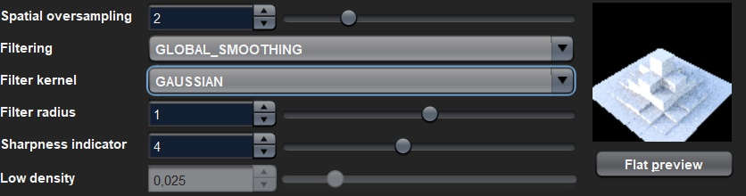
The Gaussian-filter is a very popular filter for smoothing. You can view this behavior in
the preview:

 - the middle sample has the largest influence.
 - samples which have a certain distance to  the center, have a smaller influence.
 - this influence is smaller the more distant the sample is.

====== _Example: Mitchell-filter_
[.thumb]
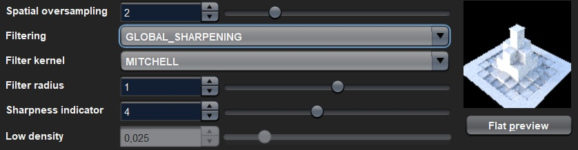
The Mitchell-filter is a very popular filter for sharpening.
In comparison to a smoothing filter, it has small areas with negative contributions, which
cause the sharpening effect.

====== _Example: Box-filter_
[.thumb]
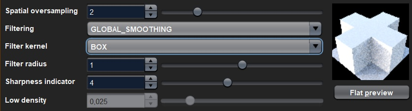

The box-filter is a special filter because it creates averages from a number of samples.
You can see this clearly in the preview, having only bars of the same size, i.e. each sample has the
same contribution.

===== _Filter radius_
A numerical value indicating the size of the effective filter kernel around each sample.
A value of 0 means no filter kernel at all, higher values lead to a growing of the filter kernel, you
can see this very well in the filter-kernel-preview.

Useful values are in the range of 0.5 to 1.5, depending on the filter kernel and amount of spatial oversampling.

===== _Sharpness indicator_
This value helps the Adaptive filter to decide which portions of the image should be sharpened and
which should be smoothed.

The higher the value, the more areas are treated as smooth areas.
The lower the value, the more areas are sharpened.

This is a very abstract value, but there is a preview-mode which helps to visualize the different areas.
This feature is described in the sub-section <<adaptive_filter_preview, _Adaptive filter preview_>> .

===== _Low density_
This value helps the Adaptive filter to decide which portions of the image should be treated as areas
with low density, and which areas should be smoothed regardless of density.

Usually, smoothing in areas of low density is more intense than in regular smoothing areas,
therefore the distinction.

The higher the value, the more areas are treated as low density areas.
The lower the value, the more areas are treated a general smoothing areas.

This is a very abstract value, but there is a preview-mode which helps to visualize the different areas.
This feature is described in the sub-section <<adaptive_filter_preview, _Adaptive filter preview_>>.

===== _Flat preview_
Displays a flat preview of the filter-kernel. In this type of view, negative values (which are typical for sharpening filters)
are colored red.

[#adaptive_filter_preview]
===== _Adaptive filter preview_
[.thumb]
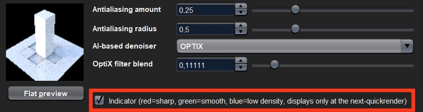
By enabling the small checkbox labelled "Indicator" and re-rendering the preview (click the Render image preview button
on the right of the preview area), you get a visualization of the different areas detected by the _Adaptive filter_ .

 - *red*: sharp areas
 - *green*: smooth areas
 - *blue*: areas with low density (which are also smoothed)

[.thumb]
image::images/preview_sharpness_indicator.jpg[scaledwidth=75%]

===== _Antialiasing amount_
Antialiasing is a technique to defend hard (or "jagged") lines or isolated pixels which seem too important.
It works by adding a little "chaos" to the individual samples.
The _Antialiasing amount_ is a measure of this "chaos".
The higher the value, the more "chaos" is applied, causing less hard lines, but possibly also causing fewer
details.
Set to 0 to disable antialiasing.
See also _Antialiasing radius_ for another parameter to influence antialiasing.

===== _Antialiasing radius_
Radius of the added "chaos" to avoid jagged lines. See _Antialiasing amount_ for a more detailed
description.

[#ai_based_denoiser]
===== _AI-based denoiser_
Type of AI-based denoiser applied to the final image:filtering_show_indicator.jpg

 - *OptiX*: a very popular denoiser by NVIDIA, requires a modern graphics card from NVIDIA, see https://developer.nvidia.com/optix-denoiser
 - *OIDN*: an open-source-denoiser by Intel, comes with fewer requirements than OptiX, see https://www.openimagedenoise.org/
 - *None*: no post-denoiser

While not mandatory for rendering single images, these AI-based denoisers are extremely
helpful when it comes to rendering animations. By using an AI-based denoiser you can cut down
rendering times significantly, by factors of 10 or more.

This works by choosing a very low render quality in JWildfire (for example, lower than normal by a factor 10)
and then "completing" those usually noisy images by using the AI-based denoiser.
It is amazing how well this works.
When you then finally assemble a compressed video sequence, you usually can see no difference when compared to rendering all the frames in high quality.

Please note, that AI-based denoisers are not available on all platforms. Therefore, JWildfire performs
some self-test at startup and presents only the available options.

You can preview this feature using the _AI Denoiser preview_ button in the preview area.

===== _OptiX filter blend_
This option is only available when choosing the OptiX denoiser. See _AI-based denoiser_ for details.
It defines a blend between the original (noisy) image and the denoised image.

 - a value of 0 means that the original image is not blended with the denoised image at all, showing only the denoised image.
 - a value of 0.5 means the original image is an average of the original and denoised images.

Usually, small values in the range between 0 and 0.2 are recommended.

You can preview this feature using the _AI Denoiser preview_ button in the preview area.

===== _Denoise image_
Using this button you can denoise an external image using the currently selected AI-based denoiser.
When using the OptiX-denoiser, the parameter _OptiX filter blend_ is taken into account.

This feature is useful when you want to play with different denoising-settings or if you forgot to enable
the denoiser or just want to denoise some non-Jwildfire-images.

Please note: It is recommended to use PNG as the file-format, other formats may work as well, but are not
guaranteed to work. Eventually, you will need to convert the image before denoising it.

[#gradient_tab]
==== _Gradient_ tab
At the gradient tab you will find numerous options to create and modify the gradients of your fractals.
Note: gradients are sometimes also referred as "palette" or "color palette".

===== _General controls_ subtab
[.thumb]
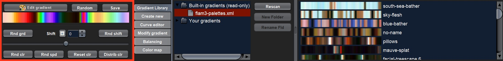
The gradient-tab contains both some general controls and some sub-tabs. The former are described in this
sub-chapter.

====== _Edit gradient_ button
Opens/closes the classic gradient-editor of JWildfire. It is outdated and not described here.
This gradient editor was superseeded by the curve-editor you find at the _Curve editor_ subtab.

====== _Random_ button
Shortcut for creating a new random gradient (using the current settings at the _Create new_ subtab).
Gradient changes are also part of the undo-history of the fractal flame, so you may switch through
the randomly generated gradients by undoing/redoing afterwards.

====== _Save_ button
Save the current gradient to the gradient-library (as *.map-file).
See the sub-chapter _Gradient library_ for futher details.

====== _Rnd grd_ button
Select a random gradient from your gradients-library. Per default, the built-in library is selected.
If you want to choose a random gradient from your own gradient-library or a sub-folder inside it, you
must select the appropriate folder.

====== _Shift_
Modifies the gradient-shift, which moves all colors by the given amount.
This is a non-destructive operation. Colors, which are "moving out" at one end of the gradient
are "moving in" on the other side.

====== _Rnd shift_ button
Applies a randomly chosen _Shift_ value.

====== _Rnd clr_ button
Sets the _Color_-parameters of all transformations of the fractal to a random value.

This does not change the gradient, but does change how it is applied to generate the
final coloring of the fractal.

====== _Rnd spd_ button
Sets the _Speed_-parameter of all transformations of the fractal to a random value.

This does not change the gradient, but does change how it is applied to generate the
final coloring of the fractal.

====== _Reset clr_ button
Sets both the _Color_- and the _Speed_-parameter of all transformations of the fractal to zero.

This does not change the gradient, but does change how it is applied to generate the
final coloring of the fractal.

====== _Distribute clr_ button
Distributes the _Color_-parameter of all transformations of the fractal evenly.

This does not change the gradient, but does change how it is applied to generate the
final coloring of the fractal.

===== _Gradient library_ subtab
[.thumb]
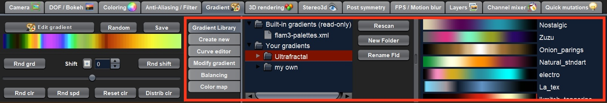

At this tab you can select pre-saved gradients and apply them to your fractal by just clicking
on them. The gradient-library contains of two parts:

- in-built gradients: those are installed together with the program and can not be modified in any way
- your own gradients. They are located in a folder outside the JWildfire-installation-drawer,
  so that they are not lost when you update JWildfire. You must specify this path in the
  <<preferences, _Preferences_>> by setting the property *tinaGradientPath*.

User-defined gradients may be structured in sub-folders in order to make them more easily accessible.

===== _Create new_ subtab
[.thumb]
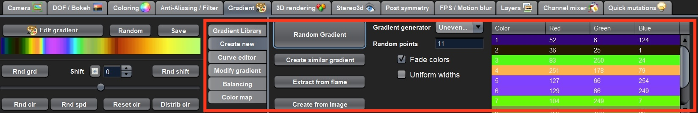

At this tab you can create gradients using various options.
The most common use is to create random-gradients by selecting one of the sophisticated built-in
random-gradient-generators.

====== _Random gradient_ button
Create a new random gradient using the currently selected options, which are described in the following sub-sections.
Each new gradient is a separate entry in the undo-history of the currently selected flame fractal, so you can
cycle through all the generated gradients by using the _Undo_ and _Redo_ button.

====== _Gradient generator_
You may choose one of the following gradient generators:

 - *(All)*: meta-random-gradient-generator which randomly chooses a random-gradient-generator to create the gradient
 - *Strong hue*: creates a smooth  gradient with strong colors
 - *Stripes*: creates a gradient with many regular color changes giving a "stripy" look
 - *Monochrome*: creates a smooth and monochrome gradient
 - *Smooth*: creates a smooth gradient with primarily pastel colors
 - *Bold*: creates a non-smooth gradient with large blocks of strong colors
 - *Two colors*: creates a smooth gradient by fading two colors into each other
 - *Uniform curves*: creates a random color curve with evenly distributed base colors and then
 derives the gradient from it. When using this generator, you have both a gradient and
matching color curves.
 - *Uneven curves*: creates a random color curve with unevenly distributed base colors.
When using this generator, you have both a gradient and matching color curves.
This setting usually creates the most interesting and versatile gradient together with the
corresponding color curves and is the default.

====== _Random points_
Number of random base colors to derive a gradient from. The more base colors, the higher the number of colors in the final gradient.

Please note, that this setting is not respected by all
random-gradient-generators (e. g. _Two colors_ will always only use two colors).

====== _Fade colors_
Fade the base colors in order to create a smooth gradient, which is the default setting.

Please note, that this setting is not respected by all
random-gradient-generators (e. g. _Bold_ will never fade colors).

====== _Uniform widths_
Distributes the base colors over the size of gradient in a uniform way.

====== _Base colors_ table
In this table you can manually edit the base colors after a gradient is created.

Please note that these base colors are not saved, so you can only edit them
at the time you create a gradient and not after saving and loading a flame.

====== _Create similar gradient_ button
Creates another random gradient which has similar colors to the current gradient,
but has a different distribution over the area of gradient.

====== _Extract from flame_ button
Load a gradient from a flame-file.

====== _Create from image_ button
Imports an image and creates a gradient from the most frequent colors found in that image.

===== _Curve editor_ subtab
[.thumb]
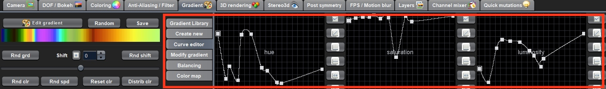

Color curves are an alternative way to edit gradients.
Using color curves usually gives much more control over the final result because it allows
very interactive editing of both the gradient and the flame at the same time.
Additionally, it allows more direct control over modifying the colors of a gradient,
making it much easier to create "dramatic" effects.

Internally, each gradient consist both of the "classic" part of the gradient and three
curves: *hue*, *saturation* and *luminosity*.
Those curves belong to the flames, and are also stored within the flame-files.

When loading an older flame-file without these curves, or assigning a "classic" gradient
to a flame, the color curves are approximated.
Usually, this  is only a very raw approximation, but this is absolutely intended.
To reach a very accurate approximation, it would require many of curve-points,
which would make the curve very hard to edit.
Therefore, the goal of the raw approximation is to make the actual editing easier and
not to have an exact synchronisation between gradient and color curves.
Color curves are meant as a powerful additional tool which are useful in very many cases,
but might not be useful in every case. For example, a gradient consisting of many small bands of color cannot be well described by a color curve.

When you start to edit one of the curves, the gradient is synchronized to the shape of the curves.
When you save and re-load a flame, you can continue the editing of the curves.

Each curve has a toolbar with little buttons to help with editing:

  - open a modal dialog for editing an enlarged version of a particular curve
  - create ramp-shaped curve
  - create line-shaped curve at the bottom (constant zero intensity)
  - create line-shaped curve at the middle (constant half intensity)
  - mirror the curve at the vertical axis
  - mirror the curve at the horizontal axis (for example, turn a constant line of zero intensity
into a line with maximum intensity)

===== _Modify gradient_ subtab
[.thumb]
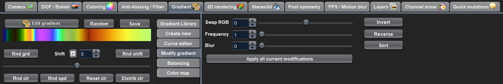
At this tab you can modify the gradient globally.
Please note that this does not take into account color curves, so any color curves will be out of sync.

===== _Swap RGB_
Swaps the color channels which changes the finally colors dramatically.
Different values swap different channels.

===== _Frequency_
Repeats the gradient inside itself. The higher the frequency the more copies are made.
Because the copies must fit in the place of one gradient, they are scaled down.

===== _Blur_
Blur smudges the colors of the gradient making it more smooth or "unsharp".

===== _Invert_
Turns the colors of the gradient into negative colors.

===== _Reverse_
Mirrors the positions of the colors (last color will be first and vice versa).

===== _Sort_
Sorts the colors by hue and brightness.

===== _Apply all current modifications_ button
All of the above options are "non-destructive", which means they do not actually modify the gradient,
but are applied dynamically. By using the _Apply all current modifications_ button, you can
finalize those changes by actually applying them to the gradient.

===== _Balancing_ subtab
[.thumb]
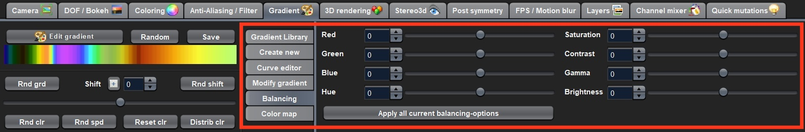
At this tab you can modify the colors of the gradient by applying typical color balancing operations.
Please note that this does not take into account color-curves, so any color-curves will be out of sync.

===== _Red_
Change the red color balance.

===== _Green_
Change the green color balance.

===== _Blue_
Change the blue color balance.

===== _Hue_
Increase or decrease the hue of the colors of the gradient.

===== _Saturation_
Increase or decrease the saturation of the colors of the gradient.

===== _Contrast_
Increase or decrease the contrast of the colors of the gradient.

===== _Gamma_
Apply an overall gamma correction.

===== _Brightness_
Change the overall brightness.

===== _Apply all current balancing-options_ button
All of the above options are "non-destructive", which means they do not actually modify the gradient,
but are applied dynamically. By using the _Apply all current balancing-options_ button, you can
finalize these changes by actually applying them to the gradient.

===== _Color map_ subtab
[.thumb]
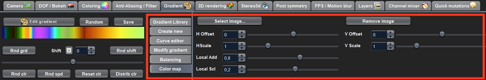
This tab has a new feature which lets you use an image as a gradient.
It works well only for flat fractals.
When coloring the fractal it takes into account both the position at the (x,y)-plane and the local
color information from the iteration process.

===== _Select image_
Select an external image.

===== _H Offset_
Horizontal offset of the image map.

===== _H Scale_
Horizontal sizing of the image map.

===== _Local Add_
Measure of influence of local color information at the current position.

===== _Local Scl_
Measure of another type of influence of local color information at the current position.

===== _V Offset_
Vertical offset of the image map.

===== _V Scale_
Vertical sizing of the image map.

===== _Remove image_
Remove the selected color map (and revert to using a regular gradient for coloring).

[#solid_rendering]
==== _3D rendering_ tab
At this tab you can influence the outcome of a fractal rendered in solid mode.
This is also an experimental feature of JWildfire.

Solid rendering basically works by treating each sample of the fractal flame
as a solid particle.
The sum of all of these particles makes up a larger solid shape.
This feature works well for only certain types of flame fractals and needs more rendering time
than "classic" fractal flames.

Solid flames usually don't work well if the structure is too thin or is in general too "chaotic" or too blurry.

Solid rendering can be used to create really unusual and interesting things.

===== _Ambient shadows_ subtab
[.thumb]
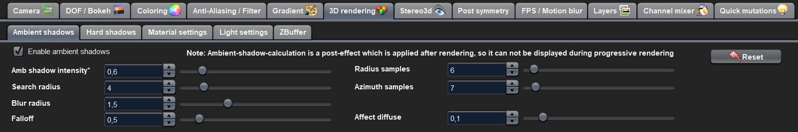
Ambient shadow calculation is an effective method for approximating more complex physical processes
that cause the image to be darker in small corner ends or crevices.

There are several methods to implements this, JWildfire uses a method based on
"Image-Space Horizon-Based Ambient Occlusion", which was developed by NVIDIA.

Ambient shadows are a global effect which is independent from any light sources.

====== _Enable ambient shadows_ checkbox
Enable or disable Ambient shadow calculation (also known as ambient occlusion).

Please note that ambient shadows are applied after the main iteration process, so it will not be displayed
in realtime during progressive rendering. Click the Render image preview button to preview the result.

====== _Amb shadow intensity_
Intensity of the ambient shadows. The higher the value the higher the darker the shadows in small corners.
If changed after a preview render, the results are seen immediately in the preview.
(This is not true of the other ambient shadow settings.)

====== _Search radius_
Distance to search for ambient occlusions.
Affects both the quality and the overall appearance of the ambient shadows.
Optimum values depends on the individual fractal. The default value should work not too badly in most cases, though.

====== _Blur radius_
Blur amount of ambient shadows. A value of 0 means no blur at all, which would look very unnatural.

====== _Falloff_
Falling off of the shadows. Higher values lead to higher falling off, making the shadows smaller.

====== _Radius samples_
Number of samples in radius-search-direction. Higher values increase both quality of the shadows
and rendering time.

====== _Azimuth samples_
Number of samples in azimuth-search-direction. Higher values increase both quality of the shadows
and rendering time.

====== _Affect diffuse_
An experimental option that allows ambient shadows to influence diffuse lighting.
This is not physically correct, but can help to generate more dramatic effects.

===== _Hard shadows_ subtab
[.thumb]
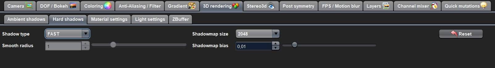
At this tab you can configure classic hard shadows which are generated with the help of shadow maps.

Hard and ambient shadows can be used at the same time and work well together.

====== _Shadow type_
These are the options:

 - *Off*: don't calculate hard shadows. This is the default setting.
 - *Fast*: classic hard shadows
 - *Smooth*: a modification of hard shadows that smooths the edges.
Produces artifacts sometimes, in which case you should use *Fast* shadows.

====== _Smooth radius_
Radius for smoothing hard shadows.

====== _Shadowmap size_
Resolution of the shadow map. The higher the resolution, the higher the quality of
the shadows, but the higher the memory consumption.

Please note that a shadow map is required for each light source. So, having many light sources
may increase memory consumption indirectly when using shadow maps.

====== _Shadowmap bias_
Sometimes shadow maps produce little stripy artifacts. By setting a small bias value those artifacts
can be bypassed. The bias value is not necessarily high when there are a large number of artifacts.

===== _Material settings_ subtab
[.thumb]
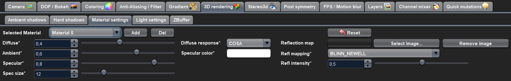
Here you can set up the materials of your fractal.
Fractals can have any number of materials, which are selected by
a material-index similar to colors by the color-index.

====== _Selected Material_ drop-down list
Here you select the material you want to edit.

====== _Add_ button
Create a new material.

====== _Del_ button
Delete the currently selected material. Use with caution as this will renumber the remaining materials but will not reference them.

====== _Diffuse_
Amount of diffuse reflection, which is light reflected from a rough surface.
The color of this component is determined by the colors of the light sources.

====== _Ambient_
Amount of ambient light. The color of this component is determined by the fractal color.

====== _Specular_
Amount of specular light, which is light reflected from a smooth surface.
The color of this component is determined by the _specular color_.

====== _Spec size_
Size of the specular reflections. Higher values produce smaller and more intense reflections.

====== _Diffuse response_
Controls how the material reflects diffuse light.

====== _Specular color_
Color of specular reflections.

====== _Reflection map_
Allows mapping of an image as an environment which is then reflected on the object's surface.

====== _Refl mapping_
The function used to map the image to the environment.

====== _Refl intensity_
Amount of light emitted by the reflection map.

===== _Light settings_ subtab
[.thumb]
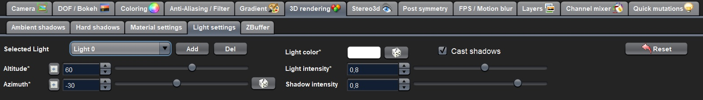
At this subtab you may set up directional light sources for solid rendering.

You may have as many light sources as you want.

====== _Selected Light_ drop-down list
Select the light source you want to edit.

====== _Add_ button
Add a light source.

====== _Del_ button
Remove the currently selected light source.

====== _Altitude_
Changes the light direction by altering the angle between the light and the z-axis.

====== _Azimuth_
Changes the light direction by altering the angle between the light and the yz-plane.

====== _Light color_
Color of the light, used for calculating the diffuse component of reflection.

====== _Cast shadows_
Choose if this light should cast shadows or not. Affects only hard shadows.

====== _Light intensity_
Intensity of the light source.

====== _Shadow intensity_
Intensity of the shadow cast by this light source.

===== _ZBuffer_ subtab
[.thumb]
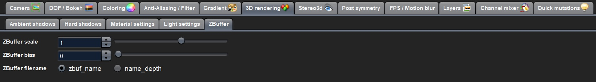
When rendering in solid mode, you may also export an additional z-buffer-image.
The settings on this tab helps to customize the creation of this z-buffer.

Hint: To export a z-buffer, you must activate the option _with Z-Buffer_ in the _Quality_-profile you are using.
See the sub-section about <<quality_profiles, _Quality Profiles_>> for more details.

====== _ZBuffer scale_
Affects the amplitude of the z-shift/depth-effect caused by the z-buffer.
The higher the value, the more dramatic the depth-effect caused by the z-buffer.
If positive, close areas are light and far areas are dark. If negative, close areas are dark and far areas are light.

====== _ZBuffer bias_
Moves the minimal z-shift.

====== _ZBuffer filename_
There are two options to control how the filename of the z-buffer-image is determined:

 - *zbuf_name*: use image filename prefixed with "zbuf_"
 - *name_depth*: append "_depth" to the image filename

==== _Stereo3D_ tab
At this tab you can change options for rendering Stereo3D images.
There are many options here, including settings to generate classic anaglyph images
as well as options to generate interpolated images.

===== Stereo3d mode
Sets the type of Stereo3D mode:

 - *None*: no Stereo3D rendering.
 - *Anaglyph*: the classic way to generate a Stereo3D image: creates one image for each eye,
turns them into gray, turns the gray into two different monochrome tones, and then merges
those two images together.
Creates one image per frame.
Requires special 3d glasses with the matching colors to view the image.
 - *Side by Side*: creates one image for each eye and puts them side by side.
Creates one image per frame.
 - *Interpolated images*: creates a number (N) of interpolated images for each eye.
Creates 2 X N images per frame.

===== View angle
Angle between the eye-lines, also called Stereo angle.

===== Eye distance
Distance between the eyes.

===== Focal offset
Offset off the camera in z-direction.

===== Preview mode
Type of preview for Stereo3D-effect:

 - *None*: no Stereo3D-preview. The fractal flame is displayed like a regular fractal flame.
 - *Anaglyph*: preview as anaglyph image.
 - *Side by Side*: preview in side-by-side mode.
 - *Side by Side Full*: preview in enlarged side-by-side mode.

*Please note, that the preview currently does not work correctly in Realtime mode.
When creating Stereo3d-images, it is recommended to <<realtime_preview, turn Realtime mode off>>*

===== Left eye color
Color of the left-eye-image in anaglyph mode. These are the options:

 - Red
 - Cyan

===== Right eye color
Color of the left-eye-image in anaglyph mode. Same options as for the left eye.

===== Images per eye
Number of interpolated images which are created for each eye in _Interpolated Images_ mode.

===== Swap sides
When checked, swaps the image for the left eye with the image for the right eye.
Side-by-side stereo images are normally designed for parallel viewing.
Checking this box creates stereo images for cross-eyed viewing.
For some people is easier to see the 3D-effect this way, while for others it is easier the
other way.

==== _Post symmetry_ tab
The options at the _Post symmetry_ tab are a very easy way to add symmetry to your fractal flames.
You could also achieve this by adding certain transformation to your fractal, but this would require
much more editing effort.
Because symmetry is a very commonly used feature in fractal imagery, JWildfire offers this additional way
to easily play with it.

==== Symmetry type
These are the symmetry types:

- *None*: no symmetry
- *X-axis*: mirror-symmetry along the x-axis (the mirror is the y-axis).
Often used to create angel-like fractals.
- *Y-axis*: mirror-symmetry along the y-axis (the mirror is the x-axis)
Often used to create portal-like fractals.
- *Point*: point-symmetry. Often used to create Mandala-like fractals.

==== Distance (only for X-axis- and Y-axis-symmetry)
Measure of the distance between the object and the mirror.

==== Rotation (only for X-axis- and Y-axis-symmetry)
Rotation angle of the mirror.

==== Symmetry order (only for Point-symmetry)
Order of the symmetry. Can be thought of as the number of copies which are placed around the
symmetry center.

==== CentreX
Offset in the x-direction to place the symmetry-center.

==== CentreY
Offset in the y-direction to place the symmetry-center.

==== _FPS/Motion blur_ tab
At this tab you can adjust options for motion-blur as well as the Frames Per Second setting for animations.
While motion-blur is typical for animations (hence the name), it can also be used to create
interesting effects for still images.

[#motion_blur_length]
===== Blur length
The number of time steps needed for each frame. The more time steps, the smoother the effect but calculation time increases.

Recommended values are in the range of 16 to 48.

A value of 0 means no motion blur.

*Please note that the calculation of motion blur may significantly reduce the realtime-animation-playback-speed.*
If you notice performance problems when previewing an animation, you should turn motion blur off temporarily.

[#motion_blur_time_step]
===== Time step
The time difference for each computed blur step. Larger time steps produce a larger blur length, but also produces
visual gaps between the individual steps.

===== Decay
Fall-off of the brightness of the generated time-steps. The visual difference increases with each time-step, which
produces "trails" with diminishing intensity at the ends.

[#fps]
===== FPS
Number of generated frames per second. This setting is a general setting for animations and is not tied to
motion-blur.

==== _Layers_ tab
Layers allow you to create complex flames by merging multiple fractals.
Unlike using traditional layers in image processing software, the layers in JWildfire are still
fractals which are "alive" and can be modified as you would regular flames.
Therefore, you can edit each layer before rendering the final image.
Additionally, layers respect that flames have three coordinates, so each layer can be moved freely in
space before rendering the image.

Flames are by nature translucent, so are always superimposed over each other.
There are no "blend modes" and the order of layers doesn't matter.

Each layer has its own:

 - set of transforms
 - set of final transforms
 - gradient

All other settings (camera, coloring, post symmetry, etc.) affect the whole flame, i.e. all layers as a whole.

===== Basic manipulations
There are basic functions for manipulating layers:

 - *Add*: to create a new blank layer with a new randomly created gradient.
 - *Duplicate*: to create a new layer and copy all transforms, final transforms and the gradient
from the currently selected layer.
 - *Delete*: to delete the currently selected layer. Please note, that the last layer cannot be
deleted.
 - *Extract*: will create a new flame in the thumbnail using only the layer that is currently selected.

===== Layer properties
Layers have the following properties which you can modify:

 - *Caption*: a free text you can use to describe the layer
 - *Visible*: this property controls if the currently selected layer is rendered or not
 - *Weight*: this property controls the intensity/weight of the current layer.
1 is normal, lower values darkens the layer, higher values make it lighter.
 - *Density*: this property controls the density of the layer: 1 (full density) to 0 (no density).

===== Hiding/Showing layers
It may be important to show/hide certain layers to help focus your editing. There
are two useful functions to support this workflow:

 - *Hide all others*: Hides all layers except the currently selected one.
 - *Show all*: makes all layers visible.

=====  Enabling _Layer append_mode
If you activate the button _Layer append mode_ on the layers-tab, every fractal you load into the
editor, will be appended as a layer. If the fractal to append has more than one layer, all layers are appended.
Only the transforms, final transforms, and gradient are appended. The other settings are ignored.

===== Adjusting flame position and orientation inside a layer
You can move any fractal (layer) freely like a 3D-object in a 3D-modeling-software. All you need is a
final transform. In flames which already have a final transform, just enable _Post transform_-editing-mode
and you will be able to drag, rotate and scale the fractal by using the mouse.

If you work with 3D-fractals you may also want to modify the fractal along the z-axis. This is also
easily done using the final transform, but you have to add variations which perform the desired
transforms as:

 - *post_rotate_x* and *post_rotate_y*
 - *post_ztranslate_wf*
 - *post_zscale_wf*
 - *affine3D*

===== Layer indicators
There are two indicators to help you to work with layers:

 - A red text "layer-append-mode active" on top of your preview if the append-mode is on.
 - A small realtime-preview of the currently selected layer on top of the main preview. This
preview is only visible if you have more than one layer and more than one layer is visible.
If you hide all layers except one (for fine-tuning of this layer) the small preview is hidden
and will not distract you. You can also turn off the preview by deactivating the Layer preview
button on the left of the Layers tab.

==== _Channel mixer_ tab
Using the channel-mixer you may influence the final coloring of your fractal by color-curves.
This modifies the final colors by mapping input values to arbitrary output values.

The simplest case is to take into account brightness levels.
The default curve is a linear ramp. Each brightness value outputs the same value.
But, when you start to modify the brightness curve, you may change this behavior.
For example, drag the curve to higher values at lower levels and vice versa.
This will increase the brightness of dark areas and darken brighter areas.

You can do the same with color levels. Overall, these are the options:

 - *Off*: no color curves
 - *Brightness*: one curve which affects only the brightness levels:
 **  new brightness as function of old brightness
 - *RGB*: one curve for each color channel:
 ** new red as function of old red
 ** new green as function of old green
 ** new blue as function of old blue
 - *Full*: three curves for each color-channel:
 ** new red as function of old red, old green and old blue
 ** new green as function of old red, old green and old blue
 ** new blue as function of old red, old green and old blue

==== _Quick mutations_ tab
"Quick mutations" tab is an easy way of creating a batch of variations of the currently selected flame.
You may load any of those mutations into the main editor by double-clicking at it.
This creates a new flame in a new slot and does not alter the original flame in any way.
You may set the default batch size for quick mutations in the <<preferences, _Preferences_>> (property *tinaQuickMutationBatchSize*).
You may also set the default mutation-type for quick mutations in the <<preferences, _Preferences_>> (property *tinaQuickMutationDefaultMutationType*).

There is also an experimental strength-parameter which effects the stengths of the mutation.
But, due to the complex overall nature of the mutation process, it is not very predictable (yet)
and does not work well in many cases.

[#quick_mutation_types]
===== _Mutation type_ drop-down list
Here you can choose the type of mutation to be executed:

 - *Add transform*: add a random transformation
 - *Add variation*: add a random variation to a randomly selected transformation
 - *Affine*: randomly change parameters of the affine component of a randomly selected transform
 - *Affine3D*: randomly change parameters of the affine component in all three dimensions of a randomly selected transform
 - *Bokeh*: add a randomized bokeh-effect
 - *Change weight*: randomly change the weight of randomly selected transformations
 - *Color type*: randomly change the color-type of randomly selected  transformations
 - *Gradient position*: randomly change the color-parameter of randomly selected  transformations
 - *Local gamma*: add randomized local-gamma-effects
 - *Random gradient*: create a new random gradient
 - *Random parameter*: change some randomly selected parameters of randomly selected variations
 - *Random ztransform*: randomly change parameters of the affine component primarily affecting the z-axis of a randomly selected transform
 - *Similar gradient*: create a similar gradient
 - *Weighting field*: add randomized weighting-field-effects
 - *All*: randomly select one of the above mutations. This is the default option.

 - *User1* to *User3*: user-defined lists of mutations. You may customize them in the <<preferences, _Preferences_>> by
editing the properties *tinaMutaGenMutationTypesUser(N)*.

==== _Batch size_
Here you can specify the number of quick mutations to create.
In some cases it may make sense to use a large number so you can create a huge batch of quick mutations with
one click and then view them later.

=== _Transformations and Scripts_
_Transformations_ and _scripts_ are the creative heart of JWildfire. Using _transformations_ you
actually create and modify the fractal structure of a fractal flame, and using _scripts_ you
can automate this.

==== _Transformations_
At this tab you can modify the structure or shape of the fractal itself.
You do this by adding and modifying transformations.

===== _Theory_
It is beyond the scope of this book to explain exactly how transformations work and how fractal flames
are generated in general.
If you are interested in the math behind fractal flames, a very good resource
is the dissertation by Scott Draves, the inventor of the fractal flame
itself: https://flam3.com/flame_draves.pdf

Many of the actions described here are very intuitive to use, and allow you to
create fractal artwork without knowing all of the processes involved (which are not too intuitive from
an artist's view.)

Besides this users manual, I'm planning to write another book which will bring the two worlds of theory and practice together.
I realize this will not happen right away, but sometime in the future.

===== _Transformations_ table
This table displays all transforms of the currently selected fractal flame.
There are two types of transforms:

- (regular) *Transforms*: they build the actual structure of the fractal.
- *Final transforms*: they are applied after the regular transforms and only affect the shape
after the fractal is created, but not the inner details.

You may think of *transforms* as being the *polygonal mesh* in a classic 3D-software, and
*final transforms* being deformations of this mesh.

===== Transformation _weights_
Each transform has a numerical weight-value attached. This value influences the priority
of this transform in the iteration process of the fractal.

===== Transformation _order_
Please note that there is _no_ transformation order. Swapping the positions of two transforms
would not change the fractal, hence there are no buttons to change the positions of the
transformation inside the table.

Importance/influence of a transform can be affected by:

- the *weight* of the transform itself
- *relative weights*, also known as *Xaos*-values

===== _Add_ button
Adds a new transform.

===== _L (Linked transform)_ button
Adds a linked transform. A linked transform is a regular transform which has a special setup
of _relative_ weights, so that it is executed after the transform it is linked to, hence the name.

===== _T (Rename transform)_ button
Opens a popup to enter a name which is displayed in the transformations table. Useful for complex fractals.

===== _Dupl_ button
Duplicate the currently selected transform.

===== _Delete_ button
Delete the currently selected transform.

===== _Add final_ button
Add a final transform. You can add multiple final transforms.
*Please note that all final transforms are applied at each iteration step. Therefore
final transforms massively affect render performance.* This does not hold for regular transforms.

===== _Affine_ tab
At this tab you can modify the affine component of a transform. This is very intuitive because
an affine transformation is a possible combination of

- movement
- rotation
- scale
- shear
- reflection

Affine transformations are represented by the controls you see in the preview
area. So, on the _affine_ tab, you can make the same changes that preview control dragging does,
but in a more precise way.

===== _Post TF_ button
Switches between editing the regular component of a transform the <<post_transform, post-transform>>-component.

===== _Reset TF_ button
Resets the selected component (regular or post) of the current transform.
This means setting the transformation coefficients so that there is no movement, rotation and scale.

==== _Preserve Z_ button
Adds a linear transform in z-direction. It is helpful when creating 3d-fractal flames which
should contain nonlinear-transforms which only support x- and y-axis.
Without activating the _Preserve Z_ option, these fractals would be flat (because any displacement
in the z-direction would be lost).

==== _X1_, _X2_, _Y1_, _Y2_, _O1_, _O2_ fields
These are called affine transformation coefficients, and they build the actual value of the transform.
Sometimes they are also called *c00*, *c01*, *c10*, *c11*, *c20*, *c21* or *a*, *b*, *c*, *d*, *e*, *f*.
If the YZ or ZX edit plane is selected, Z1 and Z2 will replace one of the other pairs.

There are two sets of these coefficients, one set for the regular component and one set for the post component.

===== _Nonlinear_ tab
On this tab you can add up to 12 nonlinear transformations (with numerous parameters) to each of the
transformations of your fractal.

====== _Linear/affine transformations_
Please note that you can also create a lot of very beautiful fractals without any nonlinear transformations.
This works by using _linear_ as "nonlinear" transformation (for each transformation) and has the advantage
that is very fast to compute. But, these are not true fractal flames.

====== _Nonlinear transformations_
The primary invention of Scott Draves, when creating the idea of fractal flames, was not only to allow "classic"
affine transformations, but also to allow arbitrary transformations.
These can be mathematically complex, but the basics are easy to understand.

- do not only allow transformations of the type rotation, translation, shear or reflections
- but do allow more generic transformations, which will still allow that the basic algorithm to work.
For example, a transformation which sets any value to 0, will probably not lead to any interesting results.
A transformation that undulates a point could be just as valid as a transformation that moves a point along
a line, but lead to much more interesting results.

So, a good way of thinking about nonlinear transforms is that they add small details to otherwise more
"straight" transformations like a rotation.

====== _Different names for nonlinear transformations_
There are different names for nonlinear transformations:

 - *nonlinear transformation*: this is the preferred name
 - *variations*: this is shorter and also common
 - *plugins*: because in some programs they are supplied as plugins which can be loaded at runtime. JWildfire
also supports the creation of some kind of plugins by using the _wf_custom_ or _wf_custom_full_-variation.
But this is intended only for exploration of some new ideas. After exploration, they are included
in the main code base, hence in JWildfire you usually do not find the term "plugin".

====== _Superimposition of nonlinear transformations_
You can add up to 12 nonlinear transformations on this tab. These will all be overlaid.
Most of the nonlinear transformations have many parameters; some really have a lot; and some can be
thought of as complete independent simulating programs.

The possibility of changing these parameters together with the superposition of different nonlinear transformations,
together with the possibility of changing parameters of the affine transformations, leads to an infinite number
of possibilities for each flame.

====== Types of nonlinear transformations_
Currently, there are about 800 nonlinear transformations included in JWildfire.

It is beyond the scope of this manual to describe them. In many cases, the description would be very
technical and would not help much (in contrast to just trying them out).

But it has turned out that there are some categories of nonlinear transformations which are well understood.
You can restrict the selection of nonlinear transformations by using these categories.
Each nonlinear transformation can have one or more of the following categories:

- *Blur*: creates a blur-effect, for example a _gaussian_blur_.
- *2D*: a transformation which is restricted to the x- and y-axis.
- *ZTransform*: a transformation which is specialized to transform to the z-axis, for example _zblur_.
- *3D*: a transformation which transforms all three coordinates.
- *DC*: a transformation which also changes the color-index (and overrides the default algorithm to calculate colors).
- *Simulation*: a more complex simulation, for example a snowflake-generator.
- *Base shape*: a transformation which creates a base-shape, for example _square_.
- *Pre*: a transformation which has the *Pre*-priority.
- *PrePost*: a transformation which has the *PrePost*-priority.
- *Post*: a transformation which has the *Post*-priority.
- *Crop*: a cropping transformation.
- *Edit formula/code*: a transformation where you can actually enter code or a formula to customize it.
- *Escape-time fractal*: a transformation which computes an escape-time fractal, for example: _fract_mandelbrot_.
- *Supports external shapes*: a transformation which can be customized by using external resources such as images, .svg-files or meshes.

====== Filtering nonlinear transformations
Currently, there are about 800 nonlinear transformations included in JWildfire.
Sometimes this is just too much, even just to play around with. You can reduce this list by using the _Filter_ option.

The _Filter_ option consists of two drop-down lists where you can choose up two _Variation profiles_:

 - when the *first* _Variation profiles_ is selected, only the variations which are inside the selected profile are displayed.
 - when *two* _Variation profiles_ are selected, only the variations which are inside the both profiles are displayed.
 - the *second* drop-down list alternatively allows you to select an *_inverted variation profile_* (prefixed by "!=" in the list).
When you select an *_inverted variation profile_* in the *second* option, only variations which are
inside the first selected _Variation profile_, but not in the _inverted variation profile_, are displayed.

[.thumb]
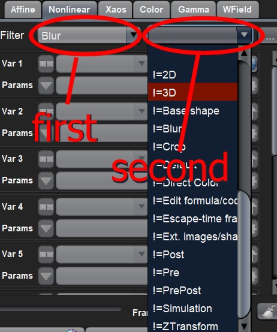

Examples:

- if no _variation profile_ is selected: all variations are displayed.
- if the _Blur_ _variation profile_ is selected as the *first* option and the *second* option is empty, then only blur-variations are displayed.
- if the _Blur_ _variation profile_ is selected as the *first* option and the _3D_ _variation profile_ is selected as the *second* option, then only blur-variations which are also 3D-variations are displayed.
- if the _Blur_ _variation profile_ is selected as the *first* option and the _!=3D_ _variation profile_ is selected as the *second* option, then only blur-variations which are _not_ 3D-variations are displayed.

The _variation profiles_ may be customized freely. See the next sub-section.

====== Editing _Variation profiles_
[.thumb]
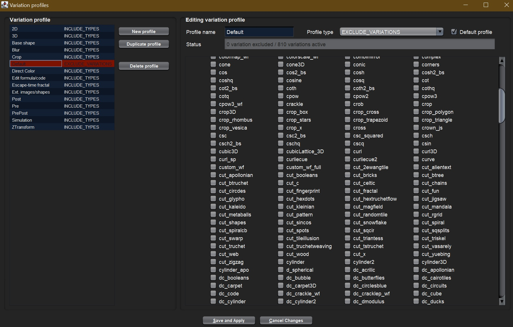
You may edit the _Variation profiles_ freely.

For each profile, these are the options to specify the _Profile type_:

- *Include variations*: specify which variations you want to _include_.
- *Exclude variations*: specify which variations you want to _exclude_.
- *Include types*: specify a list of _variation types_. Each variation that satisfies this selection will be included.
- *Exclude types*: specify a list of _variation types_. Each variation thar satisfies this selection will be excluded.

====== Adding nonlinear transformations
You can add up to 12 nonlinear transformations to each of the transformations of your fractal.
Therefore, there are 12 fixed slots on the _Nonlinear_ tab where you can select the name of the desired nonlinear
transformation from a drop-down list.

[.thumb]
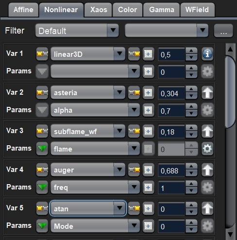

*Hint: If you know the beginning of the name, you can enter it in the selection list. The corresponding entry will then be selected.*
For example: typing s-u-b-f will select _subflame_wf_-variation.

====== Removing nonlinear transformations
There is a special empty entry in the drop-down list. It is the top entry and should be used if you want to
remove a specific nonlinear transformation from your fractal.

When you select this entry the corresponding variations will be removed and the following variations (if any) will move up.

[.thumb]
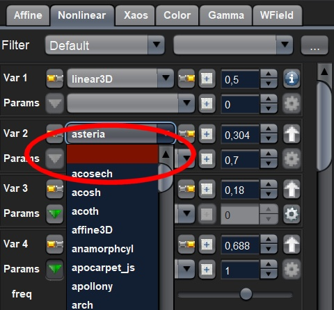

====== Editing nonlinear transformations
At each variation-slow there are the following options to edit the nonlinear transformation:

 - a _numeric field_ right of the name: this is the *amount* of this nonlinear transformation.
 - a _drop-down list_ below the name: here you can select a *parameter* of this nonlinear transformation you want to edit.
Some nonlinear transformations have no parameters. In this case the _drop-down list_ is empty.
 - a _numeric field_ right of the *parameter* _drop-down list_: this is the amount of the currently selected parameter.
 - a small _yellow/gray_ toggle button left of the name: use this button to make this transformation a _pre_-transformation.
Any non-linear transformation having the prefix "pre_" in the name usually is a _pre_-transformation by convention. In this case
the button will be active. You may change it to use this transformation as a _non-_pre_-transformation.
 - a small _yellow/gray_ toggle button right of the name: use this button to make this transformation a _post_-transformation.
Any non-linear transformation having the prefix "post_" in the name usually is a _post_-transformation by convention. In this case
the button will be active. You may change it to use this transformation as a _non-_post_-transformation.
 - a small _green arrow_ button left of the *parameter* _drop-down list_: Here you can show/hide an optional parameter panel,
with which you can control all parameters of the currently selected variation with separate sliders. Since this takes up a lot of space,
it can be switched on/off separately for each variant.

[.thumb]
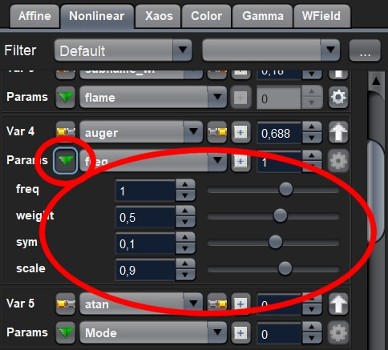

 - an _arrow_ button right of the *amount* field: here you can move this variation up one position.
 - small _cog_ button right of the *parameter *amount*: some variations have not only numeric parameters. In this case
you will need to click at this button to open a popup which allows to edit the corresponding parameter.
For example, the _svg_wf_ variation has a _svg_ parameter that points to an external *.svg* file.
If you click the _cog_ button with the parameter selected, you get a file selection dialog.

===== _Xaos_ tab
_Xaos_ is a synonym for _relative weights_. Since "Xaos" is much shorter, it was used in the user interface.
But the term _relative weights_ is much easier to understand:

- Each transformation has an attached _weight_. This is an numerical value and controls how often the
transformation is invoked in the iteration process. This weight is called an _absolute weight_.
** When using only _absolute weights_, no attention is paid to the execution order of the transformations.
- It has been observed that the execution order of certain transformations can lead to important and interesting
changes of the structure of the fractal.
** The basic idea behind _relative weights_ is to promote certain execution orders and prevent other execution orders.

====== _Relative weights_ table
The _relative weights_ are basically a matrix. Using this tab you can edit the part of this matrix that concerns
the currently selected transformation.

For each combination of the chosen transformation with all of the other transformations of the fractal, this table describes
the probability that a certain combination will be executed in the iteration process:

- the first column contains the order of execution of two of these transformations.
- the second column contains the corresponding probability that the order of execution actually can happen:

** a value of 0 means that it does not happen at all.
** a value of 1 is the default value. The actual probability is not 100%, but depends on the distribution of the _absolute weights_.

So, a relative weight of 0 is much easier to understand than the other values. Luckily, finding the right combinations
where it makes sense to use 0 as the _relative weight_ has the biggest impact on the fractal images.
All the other possibilities are also very interesting, but lead to much more subtle differences (in most of the cases).

====== _View as "to"_
Controls which values of the _relative weights_ matrix are displayed in the table.
The _View as "to"_ option shows the transitions from the currently selected transformation to any other selected transformation.
This includes the transformation itself, which can be a bit confusing at first. But calling the same transformation
again after this transformation has already been called is a perfectly valid and common behavior.

For example, having three transformations, *1* and *2* and *3*, the table will show:

- *1 to 1* and *1 to 2* and *1 to 3* when transform *1* is selected,
- *2 to 1* and *2 to 2* and *2 to 3* when transform *2* is selected,
- *3 to 1* and *3 to 2* and *3 to 3* when transform *3* is selected.

Note: changing the view mode does not affect the actual _relative weights_.

====== _View as "from"_
Controls which values of the _relative weights_ matrix are displayed in the table.
The _View as "from"_ option shows the transitions from any other transformation to the currently selected transformation.
This includes the transformation itself, which can be a bit confusing at first. But calling the same transformation
again after this transformation has already been called is a perfectly valid and common behavior.

For example, having three transformations, *1* and *2* and *3*, the table will show:

- *1 from 1* and *1 from 2* and *1 from 3* when transform *1* is selected,
- *2 from 1* and *2 from 2* and *2 from 3* when transform *2* is selected,
- *3 from 1* and *3 from 2* and *3 from 3* when transform *3* is selected.

Note: changing the view mode does not affect the actual _relative weights_.

====== _View as "to"_ vs _View as "from"_
The values displayed in these two views are in some way inverses of each other.

For example, having again three transformations, *1* and *2* and *3*:

- select transformation *1*
- in _View as "to"_ select the row *1 to 2* and press the _0_ button (setting this _relative weight_ to 0)
- switch to _View as "from"_ mode and selected transformation *2*
- you should now see that the value at the first row *2 from 1* is 0

*Please note that switching the view mode does not affect the order of execution of transformations (relative weights)
in any way. It's just different views of the same thing.*

====== _0_ button
Sets the currently selected _relative weight_ to 0. Entering a numerical value would have the same effect, but
clicking the button is easier.

====== _1_ button
Sets the currently selected _relative weight_ to 1. Entering a numerical value would have the same effect, but
clicking the button is easier.

====== _Reset_ button
Resets all the _relative weights_ of the currently selected transformation (to the numerical value 1).

====== _Reset all_ button
Resets all the _relative weights_ of all transformations (to the numerical value 1).

===== _Color_ tab
On this tab you will find important options for the coloring options. These options do not primarily determine
the final colors, but how many color details the fractal has and how they are distributed over the entire shape of the fractal.
During the iteration process, each point has an associated color. When a transformation maps a point to a new
position, it also gets a new color. The options on this tab give you control over exactly how these colors are calculated.

====== _Coloring type_/_Color_/_Speed_ (by Rick Sidwell)
The _Coloring type_ controls how the color "moves" through the fractal during the iteration process.
These are the options:

- *None*: does not change the point's color; it will be the same as the input point.
This is the default for final transforms since using a different type would reduce the color range.
- *Diffusion*: is the default flame coloring type invented by Scott Draves and used in all flame fractal programs and
is the default for normal transforms. It is based on a gradient, which can be selected and edited in the <<gradient_tab, _Gradient_ tab>>,
and uses an index to the gradient between 0 (leftmost color) and 1 (rightmost color) to set the flame colors.
There are two controls: _Color_ and _Speed_.
 ** _Color_ specifies the target gradient index for the transform. With each iteration,
the index for the point will move towards the target index.
 ** _Speed_ controls how fast it moves; 0 will move the index halfway between the current and target indices.
Higher values will move it less than halfway (more slowly); the highest value of 1 means it won't move at all;
the color won't change. Negative Speed values will move it more than halfway (more quickly); the extreme of -1 means it
moves all the way; the new color will be the gradient color matching the Color value.

- *Target*: ignores the gradient. The Color setting is a target color instead of a target gradient index.
On each iteration, the point's color will be interpolated between the current color and the target color.
_Speed_ works in the same way as DIFFUSION:

 ** 0 will make the color halfway between the current and target colors,
 ** 1 will not change the color,
 ** and -1 will set the color to the target color.

 - *TargetG*: works like *Target*, but uses the gradient to set the target color. So the target color will change
when a new gradient is selected, but the color is more likely to be consistent with other gradient colors.
The point's color is interpolated with the target color as with *Target* rather than moving along the gradient.

 - *Distance*: uses the gradient indexed by the distance the transform moved the point.
_Color_ determines the starting point and _Speed_ controls how far along the gradient each unit of distance moves from there.
Like other coloring types, a Speed of -1 sets the color to the specified color.
But the input color is ignored, so unlike the other coloring types, a Speed of 1 will still change the color.
*Distance* is especially effective for coloring flames made with a single non-base-shape transform, which are otherwise
quite difficult to color.

 - *Cyclic*: uses the gradient, but simply shifts the gradient index right by the amount specified by Speed.
If it goes off the end of the gradient, it wraps around to the other side. *Cyclic* will not converge to a color when iterated,
therefore it doesn't work as the only coloring type in a flame; some other iterated transform needs to use *Diffusion* to get a stable
color that *Cyclic* can use as a starting point.
Normally, Speed is set to m/n, where m and n are small integers; this makes the colors cycle through n gradient colors,
and is especially useful for coloring tilings.

====== _Draw mode_/_Opacity_
Controls the visual contribution of the currently selected transformation to the fractal.

These are the options:

- *Normal*: each iteration point contributes to the fractal without any modification.
- *Hidden*: the contribution of the currently selected transformation is invisible (not drawn).
- *Opaque*: the contribution of the currently selected transformation is faded out by taking into account the _Opacity_ parameter.
Any value between 0 and 1 is possible, including the two extremes:

 ** 0 means minimum Opacity, this is equal to using the *Hidden* setting.
 ** 1 means maximum Opacity, this is equal to using the *Normal* setting.

====== _Material_/_Mat Spd_
Works similar to _Color_/_Speed_, but controls the material index used in <<solid_rendering, Solid rendering>> rather than
the color index.

===== _Gamma_ tab
On this tab you will find some advanced color change options. They are an extension of the original fractal flame algorithm.

The original fractal flame algorithm uses a gradient together with a pointer to a certain position within this gradient
to color the fractal. This gradient pointer changes during the iteration process, i.e. it points to different colors,
which eventually causes the fractal to contain different colors.
The change of the gradient pointer is controlled by the _Color_ and _Speed_ parameters, which you can find on the _Color_ tab.

The basic idea behind the extension of this algorithm was to change similar color-related properties with a similar process:

- *Gamma*
- *Contrast*
- *Saturation*
- *Hue*

Therefore, on this tab you will find pairs of parameters: the parameter itself and its rate of change, e.g. _Gamma_ and _Gamma Spd_.
The parameters _Gamma_ and _Gamma Spd_ were the first, hence the name of the tab.

And because this kind of effect is local (changes with each iteration), it is called a *local color change*.
Again, because the change in _gamma_ was the first change introduced, these effects are called *local gamma* effects.
(But there was not enough space in the user interface, hence only the name _Gamma_ of the tab.)

====== _Gamma/Gamma Spd_
These parameters control local changes in gamma correction. A higher gamma correction brightens the fractal (locally) and vice versa.

====== _Contrast/Contrast Spd_
These parameters control local changes in contrast.

====== _Saturation/Saturation Spd_
These parameters control local changes in saturation. Can help create very dramatic effects.

====== _Hue/Hue Spd_
These parameters control local changes of the hue. Can lead to very unusual effects, as the hue can change drastically.

===== _Randomize all_ button
Creates a random local gamma effect:

- when the _Whole fractal_ checkbox is checked, each transformation of the fractal might be affected.
- when the _Whole fractal_ checkbox is not checked, a random local gamma effect is only applied to the current selected transformation.

===== _Reset all_ button
Removes the local gamma effect:

- when the _Whole fractal_ checkbox is checked, the local gamma effect for each transformation of the fractal is removed.
- when the _Whole fractal_ checkbox is not checked, only the local gamma effect for the current selected transformation is removed.

===== _Whole fractal_ checkbox
Affects how the _Randomize all_ button and the _Reset all_ button will work, please see above.

===== _WField_ tab
Weighting fields are a nice artistic tool that can be used to create very organic-looking fractals,

The basic idea is to add some kind of "natural disturbance" at the transform-level to the flame-fractals.
This is done in a non-destructive way, i.e. without changing the actual flame. This makes it very easy and intuitive to
try out different styles and parameter combinations.
It is possible to choose between different types of this kind of disturbance, for example the classic
_Perlin Fractal Noise_ for a very organic style.
You can also load image-maps (photographs) for more individual styles. Each weighting field type offers various options.

Currently, the following fractal-parameters may be affected by a weighting-field:

- variation-amount
- variation-parameter-amount (for up to three parameters per transformation, for example, _frequency_ parameter of a _waves_-transform)
- color-index (allows subtle color-changing effects)

===== _Weighting field_ drop-down list
Type of the weighting field to apply to the currently selected transformation.
These are the choices:

- *None*: no weighting field
- *Cellular Noise*: apply a weighting field using the _cellular noise algorithm_. This produces
structures which look like cells.
- *Cubic Noise*/*Perlin Noise*/*Simplex Noise*/*Value Noise*: apply a weighting field using the
selected _noise algorithm_. This gives a nice organic look.
- *Cubic Fractal Noise*/*Perlin Fractal Noise*/*Simplex Fractal Noise*/*Value Fractal Noise*: apply a
weighting field using the selected _fractal noise algorithm_. This also gives a nice organic look.
The word "fractal" here means applying the same type of noise multiple times at different scales.
- *Image Map*: apply a weighting field using the levels of red color channel of the given image map.

===== _Input coordinate_ drop-down list
Sets the position where the weight field is calculated. These are the options:

- *Position*: Position of the current iteration point before applying the affine transform
- *Affine*: Position of the current iteration point after applying the affine transform

===== _Var amounts_
Strength by which the magnitude (also called _amount_) of the nonlinear variations is influenced by the weighting field.
A value of 0 means no influence by a weighting field.

===== _Color amount_
Strength by which the color-calculation is influenced by the weighting field.
A value of 0 means no influence by a weighting field.

===== _Var param 1_/_Var param 2_/_Var param 3_
You can define up three parameters of nonlinear transformations which may be affected by the
weighting field. The numerical field specifies the magnitude, in the drop-down list you select the name of the parameter.
A value of 0 means no influence by a weighting field.

===== _Jitter amount_
Strength of noise to add after the transformation. A value of 0 means don't add additional noise.

===== _Seed_
Parameter to randomize the shape of the noise. Different values lead to different distributions.

===== _Frequency_
Frequency of the noise. Larger values lead to more details, smaller values lead to a more smooth shape.

===== _Gain_/_Octaves_/_Lacunarity_/_Noise Type_
These options for fractal noise control how to apply the same type of noise multiple times at different scales.

===== _Return Type_/_Distance Function_
These options control the shape of _cellular noise_.

===== _CentreX_/_CentreY_/_SizeX_/_SizeY_
These options control how to place the image map when using the option *Image map* as Weighting field type.

===== _Randomize all_ button
Creates a random weighting field:

- when the _Whole fractal_ checkbox is checked, each transformation of the fractal might be affected.
- when the _Whole fractal_ checkbox is not checked, a random weighting field is only applied to the current selected transformation.

Hint: On small monitors this button might be hidden per default. You can resize the whole window or the transformations table to make it visible.

===== _Reset all_ button
Removes the weighting field:

- when the _Whole fractal_ checkbox is checked, the weighting field for each transformation of the fractal is removed.
- when the _Whole fractal_ checkbox is not checked, only the weighting field for the currently selected transformation is removed.

===== _Whole fractal_ checkbox
Affects how the _Randomize all_ button and the _Reset all_ button work, please see above.

==== _Scripts and Custom-Buttons_
At this tab you can manage JWF-scripts and organize custom buttons which allow easier access
certain scripts.

Custom-buttons are completely optional. You can also execute scripts directly from the _Scripts_ library
by double-clicking at a script name.

JWF-scripts are written in the Java-language and can use most of the language-features offered by
Java 1.4. Therefore you could also read external files, access resources from the internet,
open custom-windows etc.
There are also several possibilities to interact with the <<fractal_flame_editor, Main Editor>>,
for example, to modify the currently edited flame and to refresh the preview.

===== _Scripts_ library
The scripts-library contains of two parts:

- built-in scripts: these are installed together with the program and can not be modified in any way.
- your own scripts: these are located in a folder outside the JWildfire-installation-drawer,
so that they are not lost when you update JWildfire. You must specify this path in the
<<preferences, _Preferences_>> by setting the property *tinaJWFScriptPath*.

User-defined scripts may be structured in sub-folders in order to make them easier to find.

===== _Import script_ button
Import a script from an external file. The following file-types are supported:

- a single *.java*-file containing the script-code
- a *.zip*-archive containing the script-code together with additional files or folders.

When you download scripts from the internet, for example from https://www.jwfsanctuary.club, they usually come
as .zip-files.

===== _New_ button
Create a new script from scratch. This is rarely used; it is usually easier to duplicate
an existing script or to create a script from a flame and then modify it.

===== _Dupl_ button
Duplicates the currently selected script.

===== _From flame_ button
This is a very useful function to get started with creating scripts. It creates a script
which contains all the Java-code to create the currently selected flame.

This has the following purposes:

- you have a working script which actually produces something with a single button-click, and
- by modifying certain parts you can programmatically create similar flames.

===== Creating flame-randomizers
This function also creates code, which randomizes certain parameters at the level
of each transform. This code is inactive by default.
The generated flames of this script will always look the same until you
modify the script. This is intentional, because randomizing a random selection of
parameters usually does not lead to interesting results. Therefore you must find out for yourself,
which parameters are good for randomizing a flame and which are not. This always depends
on the type of fractal, and small differences between flames may affect this behavior in
a very strong way.

You can find the inactive code by looking for comments like this:
[source,java]
----
// random affine transforms (uncomment to play around)
//   XFormTransformService.scale(xForm, 1.25-Math.random()*0.5, true, true, false);
//   XFormTransformService.rotate(xForm, 360.0*Math.random(), false);
//   XFormTransformService.localTranslate(xForm, 1.0-2.0*Math.random(), 1.0-2.0*Math.random(), false);
// random affine post transforms (uncomment to play around)
//   XFormTransformService.scale(xForm, 1.25-Math.random()*0.5, true, true, true);
//   XFormTransformService.rotate(xForm, 360.0*Math.random(), true);
//   XFormTransformService.localTranslate(xForm, 1.0-2.0*Math.random(), 1.0-2.0*Math.random(), true);
----
The first line is an actual comment (not code). But the 2nd line is code, which was commented out.

- _Commenting in_ means to remove the characters *//* at the start of line, this activates the code.
- _Commenting out_ means to add the characters *//* at the start of a line, this inactivates the code.

If you now _comment in_ the 3rd line, you apply a rotation by an angle which is randomized.
[source,java]
----
XFormTransformService.rotate(xForm, 360.0*Math.random(), false);
----
The expression *360.0*Math.random()* calculates a random value between 0 and 360, which
differs each time you execute the script. So you will get a different fractal flame
each time you execute the script.

If you see that this leads to interesting effects, you may leave it that way and work at another transformation or,
otherwise you could uncomment another line of this pre-generated code. You can also play with the values, for example,
to replace the *360* by some smaller value when the rotations are too large.
Of course, you can combine all of these code-fragments freely and also add your own code.
A rule of thumb is that many large changes at a fractal flame at the same time
do not lead to interesting results. In many cases you will not have any visible result at all.

===== _Btn_ button
Create a <<macro_buttons, _Macro button_>> in the bottom area of the preview to execute the currently selected script.
You can remove this button using the _Delete_-button at the <<macro_buttons, _Macro buttons_ subtab>>.

===== _Scan_ button
Rescans the script-library. This is only necessary when you modified files from outside JWildfire or changed
the library-path in the _Preferences_.

===== _Run_ button
Runs the currently selected script.

===== _Edit_ button
Opens a pop-up window to edit the currently selected script.

===== _Description_
Shows a description of the script, which might contain hints for usage or copyright information.
Use the Edit button to edit the text.

===== _Code preview_
Shows the code of the script. Because this area is too small for making changes there is a separate _Edit_ button
to edit the script.

[#macro_buttons]
===== _Macro buttons_
At this tab you can control so-called _Macro buttons_. A _Macro button_ is a button which executes a
script. Scripts are also called _Macros_, hence the name.

Macro buttons appear either below or to the right side of the Preview/Editor area,
depending on the *tinaMacroButtonsVertical* setting in _Preferences_.

Add a new Macro button by selecting a script and clicking the _Btn_ button as described above.

====== _Macro buttons_ table
In this table all _Macro Buttons_ are displayed and you can also edit the label and short hint of each button.

====== _Up_ button
Moves the button in the user-interface one position to the left.

====== _Down_ button
Moves the button in the user-interface one position to the right.

====== _Delete_ button
Deletes the currently selected _Macro button_.

=== Global functions
In this section you will find global functions that are used very often. For example, loading and saving flame files or generating
random flames.

==== _Random batch_ button
Creates a new batch of random flames and displays them in the _thumbnail ribbon_.
This is probably one of the most popular features of JWildfire because using this function
allows you to create endless beauty in a very relaxing way. It is also very unlikely that you will
ever generate two fractals which look exactly the same, so it's likely that you
will be surprised by new and interesting results even after years of using the program.

Please note that this will, per default, remove any previously loaded flames together
with their undo-history from memory. So, any changes you did not save will be lost.
You can change this behavior by editing the parameter *tinaRandomBatchRefreshType* in
the <<preferences, _Preferences_>>.

The random-flame-generating-process can be influenced by changing the following parameters:

 - *Rnd flame-generator*
 - *Rnd Symmetry*
 - *Rnd Gradient*
 - *Rnd WField*
 - *tinaRandomBatchSize* (in the <<preferences, _Preferences_>>)
 - *tinaRandomBatchBGColorRed*, *tinaRandomBatchBGColorGreen*, *tinaRandomBatchBGColorBlue* (also in the <<preferences, _Preferences_>>)

All of these parameters may be combined freely to create customized random flames. See the following sub-sections
for more details about these parameters.

===== Example of combination of parameters for creating specific random flames

For example, to generate mandala-like-structures which look very organic and have a yellowish background, you could
use the following setup:

 - *Rnd flame-generator*: *Simple (stunning)*
 - *Rnd Symmetry*: *Point*
 - *Rnd Gradient*: any
 - *Rnd WField*: *(All)*
 - *tinaRandomBatchBGColorRed*: *235*
 - *tinaRandomBatchBGColorGreen*: *215*
 - *tinaRandomBatchBGColorBlue*: *75*

[.thumb]
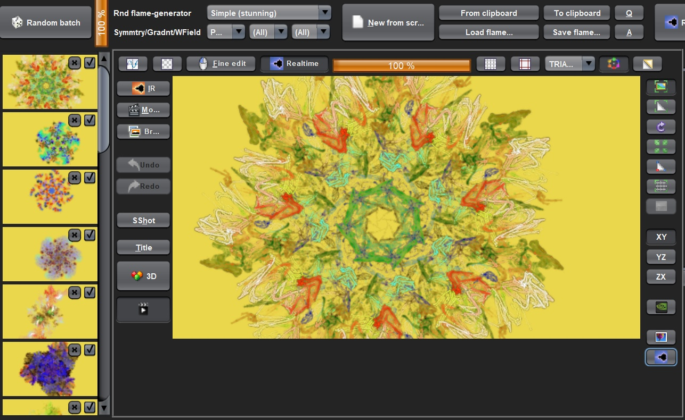

==== _Rnd flame-generator_

Here you can choose the random-flame-generator that will be used to generate a batch of random flames.
A random-flame-generator is a set of instructions to generate a skeleton of a certain type of fractal
and fill this skeleton with random values or random sub-structures.
What works well and what does not work well depends on the type of fractals. Sometimes the result is just the
random change of a single number, or sometimes a random transformation or formula is inserted.

Typically, the JWildfire random-flame-generators employ the strategy of using some well explained
ranges of parameters together with a large degree of freedom. This way you can often get a very pleasing result,
and you may encounter some new variations/shapes which you have never seen or tried before.

There are two types of random-flame-generators:

 - *meta-random-flame-generator*: uses randomly-chosen random-flame-generators internally
 - *random-flame-generator*: actually creates a random flame

===== The special "All"-random-flame-generator
The most common random-flame-generator is the default generator named "All".
It is a meta-random-flame-generator and contains all the other random-flame-generators.
When it generates a random flame, it randomly selects one of those internal generators
to do the actual work.
By choosing "(All)" you will get the most diverse results.

==== Rnd Symmetry
Sets the random-symmetry-generator for generating random flames.
This generator randomly sets post-symmetry-options of the random flames.

These are the options:

 - *None*: the flame will have no post-symmetry
 - *XAxis*: a random x-axis-symmetry
 - *YAxis*: a random y-axis-symmetry
 - *Point*: a random point-axis-symmetry
 - *(All)*: randomly selects a random-symmetry-generator of generating post-symmetry
 - *(All, sparse)*: like *(All)*, but with reduced probability to generate post-symmetry at all

The default value is *(All, sparse)*, which means it will randomly create random symmetry of all types,
but only a few random flames.

See the section about _Post symmetry_ for more details about the types of post-symmetry and related parameters.

==== Rnd Gradient
Set the random-gradient-generator for generating random flames.

There are the following options:

- *(All)*: meta-random-gradient-generator which randomly chooses a random-gradient-generator to create the gradient
- *Strong hue*: creates a smooth  gradient with strong colors
- *Stripes*: creates a gradient with many regular color changes, having a "stripy" look
- *Monochrome*: creates a smooth and monochrome gradient
- *Smooth*: creates a smooth gradient with primarily pastel colors
- *Bold*: creates a non-smooth gradient with large blocks of strong colors
- *Two colors*: creates a smooth gradient by fading two colors into each other
- *Uniform curves*: creates a random color curve with evenly distributed base colors and then
derives the gradient from it. Using this generator will give both a gradient and
matching color curves.
- *Uneven curves*: creates a random color curve with unevenly distributed base colors.
Using this generator will give both a gradient and matching color curves.

The default setting is _Uneven curves_, which creates usually the most interesting and
versatile gradients together with corresponding color curves.

==== Rnd WField
Set the random-weighting-field-generator for generating random flames.

These are the options:

 - *Cellular Noise*: create random weighting-fields using Cellular Noise
 - *Basic Noise*: create random weighting-fields using basic noise, like Perlin noise
 - *Fractal Noise*: create random weighting-fields using fractal noise, like Perlin fractal noise.
Fractal noise means to apply one type of noise multiple times at different scales.
 - *Image Map*: create random weighting-fields using an image map.
By default, the same fixed internal map is always used. You can change it by editing the flame afterwards.
 - *(All)*: randomly selects a random-weighting-field-generator to generate weighting-fields
 - *(All, sparse)*: like *(All)*, but with reduced probability of generating weighting-fields at all

[#new_from_scratch]
==== New from scratch
Create a new and empty flame with a random gradient. This is usually the first step when creating a fractal
manually "from scratch", hence the name.

==== From clipboard
Load a flame which was stored in the clipboard.

In social-media it is common to exchange flame-files in text-form by posting them. When loading such a flame
you usually copy the text and the use the _From clipboard_ button to load it into JWildfire.

==== Load flame
Load a flame from a file and display it in the _Thumbnail ribbon_.

Flame files can also contain a batch of flames. In this case, each flame from the flame-batch-file will be
imported as an individual flame which is displayed as an individual thumbnail in the _Thumbnail ribbon_.
Each individual flame  of such a batch also has its own undo-history.

==== To clipboard
Stores the currently selected flame in text-form in the Clipboard.

In social-media it is common to exchange flame-files in text-form by posting them.
Using this function you may export your flame to paste it somewhere, for example, Facebook.

==== Save flame
Save the currently selected flame.

==== Q (Quicksave)
Quicksaves the currently selected flame by automatically generating a filename in the
form *"qsave_" + <Date> + <Counter> +".flame"* in the folder where the last flame was saved (the default flame folder if this is the first).
You may set the default flame folder in the <<preferences, _Preferences_>> by changing the property *tinaFlamePath* .

==== A (Save all)
Save all selected flames together into one flame. Selected flames are indicated by a small checkmark at the
right upper edge of the thumbnail. See the sub-section <<selecting_flames_thumbnail_ribbon, _Selecting flames in the thumbnail ribbon_>>
for more information about selecting flames.

[#render_image_movie]
==== _Render image/movie_ button
Render the current flame using the selected <<quality_profiles, _quality_>> and <<resolution_profiles, _resolution profile_>>.

Rendering means to create a final image and consists of the following steps:

 - perform the fractal iteration process, possibly using an increased internal resolution (compared to the desired image resolution).
See _Spatial oversampling_ for details.
 - perform tone-mapping by turning the raw fractal information into colored pixels.
See the section about the _Coloring tab_ for more details.
 - optionally perform AI-based denoising. See _AI-based denoiser_ for more details.

When you click the Render image/movie button, you will be prompted for the filename to use.
The extension determines whether to render an image or movie. Use .png or .jpg to render an image, or .mp4 to render a movie.

The rendering runs in the background and can be cancelled at anytime. But, you can not render
more than one flame at a time here. For rendering multiple images see the section
about <<batch_renderer, _Batch renderer_>>.

==== _Render resolution_ drop-down list
Here you choose the desired render resolution by choosing a _Resolution profile_.
JWildfire comes with some predefined _resolution profiles_, but you can also customize them.

Even when you do not render the flame in the main editor, the correct render resolution should be
specified because of the aspect ratio. After changing a _resolution profile_, JWildfire will change the
size of the preview-area accordingly to the aspect ratio of the selected _resolution profile_.
For example, when you select a profile with same width and height, you will have a square shaped preview area.

[#resolution_profiles]
==== Edit _resolution profiles_
Edit the list of resolution profiles by clicking the button to the right of the render resolution drop down list.
In this pop-up window you may alter existing _resolution profiles_ as well as create your own.

These are the parameters:

 - *Width* x *Height*: image resolution
 - *Default profile*: one profile can be defined as the default profile. The profile is chosen when you start JWildfire.

==== _Render quality_ drop-down list
Here you choose the desired render quality as well as some output options by choosing a _Quality profile_.
JWildfire comes with some predefined _quality profiles_, but you can also customize them.

Especially when using an AI-based post-denoiser, you may want to revisit your quality profiles.
Such a denoiser can help to create visually appealing results with much lower quality settings
in order to reduce render times. The default settings were designed to be used without such a denoiser.
See the sub-chapter _AI-based denoiser_ for more details.

_Quality profiles_ also contain the information about which type of images should be generated.
For example, you may specify inside a _quality profile_ that JWildfire shall generate an additional z-buffer-image
when using solid rendering.

[#quality_profiles]
==== Edit _quality profiles_
Edit the list of quality profiles by clicking the button to the right of the render quality drop down list.
In this pop-up window you may alter existing _quality profiles_ as well as create your own.

There are the following parameters:

- *Quality*: quality level
- *with HDR*: create an additional _High Dynamic Range Image_ in .hdr-format.
Such an image contains raw colors in a much more precise way than conventional images.
But, it can usually not be displayed without special software.
Is is similar to an RAW-image in photography.
- *with Z-Buffer*: create an additional z-buffer-image. Together with the actual image of the fractal you can
create "3d wiggle images" which are/were popular on some social media platforms like Facebook.
Currently, this is only implemented for fractals rendered in solid mode.
- *Default profile*: one profile can be defined as the default profile. The profile is chosen when you start JWildfire.

==== Batch renderer
Quick-saves the currently selected fractal flame and sends it to the <<batch_renderer, _Batch renderer_>>.

Please note, that this does not actually render the fractal flame.
You must later open the _Batch renderer_ and invoke the rendering process.
Therefore, it is just a shortcut to simplify adding fractal flames to the rendering batch.

Hint: when you continue to  edit the fractal flame and create a quicksave again, the _Batch renderer_
will still render the earlier quicksave you sent to the <<batch_renderer, _Batch renderer_>>.

[#mutagen_module]
== _MutaGen_ module
[.thumb]
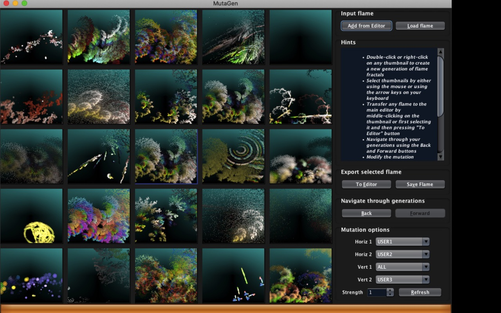

In this module you may create mutations of a certain flame in an interactive way.
Open the MutaGen module by selecting _Fractal flames: MutaGen_ from the _Windows_ menu.

There are several mutation types affecting different "genes" (types of flame properties).
Those mutations are applied at two levels: generation A (8 new fractals from the base flame)
and generation B (16 new fractals from generation A), generating a total of 24 new flames at each mutation step.

You can easily exchange fractals between the main editor and the new module at any time.

There is also a history, i.e. you can navigate back to earlier generations at any time.

See the section about <<quick_mutation_types, _Quick mutation types_>> for a description of available mutation types.

[#interactive_renderer_module]
== _Interactive Renderer_ module
[.thumb]
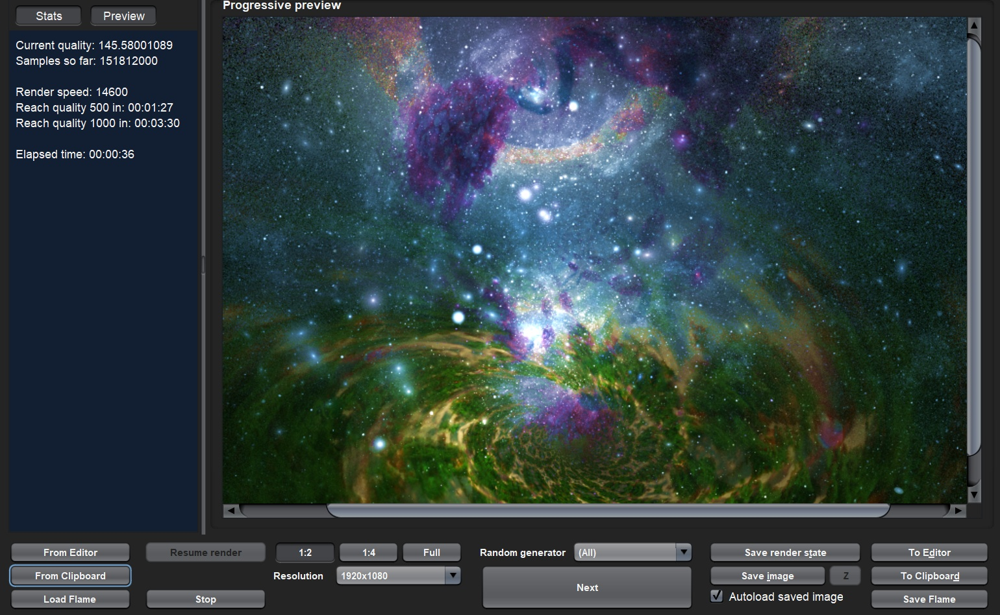

The _Interactive Renderer_ is an alternative rendering module which focuses on rendering a single image
in contrast to the <<batch_renderer, _Batch Renderer_>> which renders multiple images.
Open the Interactive Renderer module by clicking the Interactive Renderer button on the left of the preview area or
by selecting _Fractal flames: Interactive renderer_ from the _Windows_ menu.

The _Interactive Renderer_ has three main purposes:

 - allows the user to watch the rendering process for important artwork to let it render "until it is done".
 - explore random fractal flames and watch them get rendered and become clearer and clearer. This may be very relaxing.
 - explore the fractal rendering process in general.

=== Saving the image while rendering
While rendering is in progress you may save a snapshot of the current image at any time.
This will not influence or even interrupt the ongoing rendering process in any way and is
an intended workflow.

=== Stats
Statistics about the current quality level and predictions when new quality levels will be reached
are shown in the top left of the Interactive Renderer window.

You may toggle viewing of Stats off when you are not interested in them by clicking the Stats button.
This will slightly improve render performance.

=== Preview
While previewing the image during rendering is a key-feature of the _Interactive Renderer_, it also
slows down rendering. For most of the flames the slowdown will be negligible, but there can be
a significant slowdown for some flames.
So you may want to alternate between faster rendering for a short period and monitoring the
render progress using the Preview button.

=== From Editor
Imports the currently edited fractal flame from the _Main Editor_ and starts rendering it.

*Please note that this will cancel any ongoing render and you will lose any unsaved results.*

=== From Clipboard
Imports a fractal flame from the clipboard and starts rendering it.

*Please note that this will cancel any ongoing rendering and you will lose any unsaved results.*

=== Load flame
Loads a fractal flame from a flame and starts rendering it.

*Please note that this will cancel any ongoing rendering and you will lose any unsaved results.*

=== Resume render
Loads a previously saved <<render_state, _Render State_>> and starts rendering it.

*Please note that this will cancel any ongoing rendering and you will lose any unsaved results.*

=== Stop
Stops the current ongoing rendering process.

*Please note that the render can not be resumed. You must save the <<render_state, _Render State_>>
before stopping the render when you want to be able to continue a render.*

=== 1:2
Sets the render size to one half of the currently selected render size. Can help to get a quick preview
when rendering at very large resolutions.

=== 1:4
Sets the render size to one quarter of the currently selected render size. Can help to get a quick preview
when rendering at very large resolutions.

=== Full
Uses the full render resolution of the selected <<resolution_profiles, _Resolution Profile_>>.
This is the default setting.

=== Resolution
Desired render resolution. See the sub-section about <<resolution_profiles, _Resolution Profiles_>>
for defining custom resolutions.

[#render_state]
=== Save render state
Save the current state in a proprietary format. You may load this file later to continue rendering
at exactly the same step.

=== Save image
Create a snapshot of the current render and save it as an image.

=== Z (Save Z-Buffer)
Create a snapshot of the current render and save it as a z-buffer. Currently, z-buffers are only
supported when rendering in <<solid_rendering, solid mode>>.

=== Autoload saved image
When this option is checked, JWildfire will automatically load and display images created by
_Save image_ and the _Z (Save Z-Buffer)_ function.
Viewing the final image may help to better decide when rendering is complete rather than viewing the render-preview.

=== To Editor
Transfer the currently rendered flame to the Main editor.

=== To Clipboard
Transfer the currently rendered flame to the clipboard.

=== Save Flame
Save the currently rendered flame to file.

=== Next (random flame)
Creates a random flame and starts rendering it.

*Please note that this will cancel any ongoing rendering and you will lose any unsaved results.*

=== Random generator
Select the random-flame-generator used to generate a random-fractal-flame when using the _Next_ button.

[#flame_browser_module]
== Flame Browser
[.thumb]
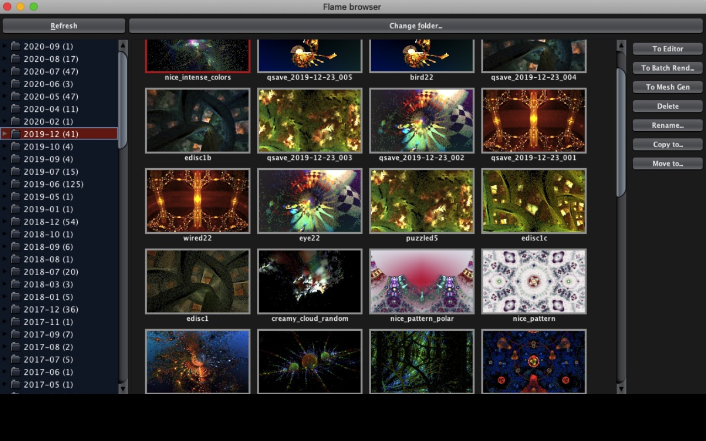

The flame-browser can help you to get an overview of the fractal flames you have created over the time.
It can scan a base-folder for flame-files and will display them as thumbnails in reverse chronological order.
For a cleaner structure, for each month a separate virtual folder is created and flames are distributed over
this folder-structure.
Open the Flame Browser by clicking the Flame Browser button on the left side of the preview area or by
choosing _Fractal flames: Flame browser_ from the _Windows_ menu.

On the right side of the window you can execute one of the following actions on the selected flame:

 - *To Editor*: load the selected flame into the <<fractal_flame_editor, _Main Editor_>>
 - *To Batch Renderer*: send the selected flame into the <<batch_renderer, _Batch renderer_>>
 - *To Mesh Gen*: send the selected flame into the <<mesh_generator, _Mesh generator_>>
 - *Delete*: delete the selected flame
 - *Rename*: rename the selected flame
 - *Copy to*: copy the selected flame into another folder
 - *Move to*: move the selected flame into another folder

[#easy_movie_maker_module]
== _Easy Movie Maker_ module
[.thumb]
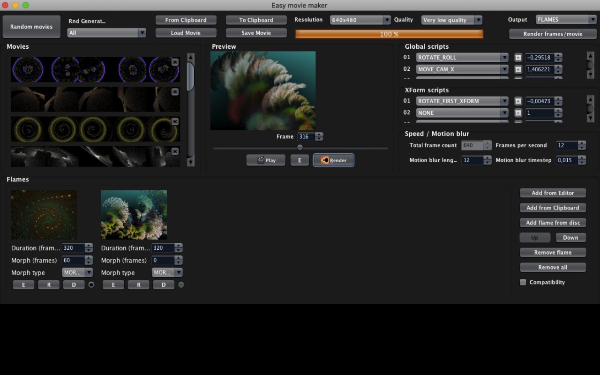
With the _Easy Movie Maker_ you can create animations consisting of multiple flames.
Open the Easy Movie Maker module by clicking the Easy Movie Maker button on the left of the preview area or
by selecting _Flame fractals: Easy movie maker_ from the _Windows_ menu.

It combines three types of animation:

 - the keyframe-based animation of a fractal flame itself. You set up these kinds of animations in the
<<fractal_flame_editor, Main Editor>>
 - transitions between two fractal flames
 - global animation scripts, for example, a movement of the camera

You can even generate random movies, which is an experimental feature.

=== _Thumbnail ribbon_
There is a thumbnail ribbon on the left, which holds all currently loaded movies.
(This is very similar to the thumbnail ribbon inside <<fractal_flame_editor, Main Editor>>, which hold all currently loaded flames.)
You may select a movie by double-clicking at its thumbnail.

=== Functions at the main button bar (at the top)
Here you find global functions at the movie level.

==== _Random movies_
Using this button you can generate random movies using the selected random-movie generator.
This works by generating random-flames and then applying random motions to them.
This is currently limited to creating movies containing only one animated flame.

===== _Rnd generator_
These are the options:

 - *Transforming bubbles*: generates a random fractal of type _bubbles_ and applies random motions at the transformation level to it
 - *Transforming duckies*: generates a random fractal of type _duckies_ and applies random motions at the transformation level to it
 - *Rotating Mandelbrots*: generates a random fractal of type _Mandelbrot_ and applies a random rotation-motion to it
- *All*: randomly selects one of the random-movie-generators mentioned above to generate a random movie

==== _From clipboard_
Loads a movie-file from the clipboard and appends it to the _thumbnail ribbon_.

==== _From movie_
Loads a movie from a file and appends it to the _thumbnail ribbon_.

==== _To clipboard_
Transfers the currently selected movie in text-form to the Clipboard.

==== _Save Movie_
Saves the currently selected movie to a file.

==== _Resolution_
Here you select the <<resolution_profiles, _resolution profile_>> for rendering the movie.

==== _Quality_
Here you select the <<quality_profiles, _quality profile_>> for rendering the movie.

==== _Output_
These are the output-options for generating a movie:

- *Flames*: Produces a batch of flame-files (one flame file for each frame position), which are rendered later
using the <<batch_renderer, Batch renderer>>. This is the recommended setting for larger projects, because
using the <<batch_renderer, Batch renderer>> for rendering images is the most comfortable way in JWildfire.
It supports pausing/resuming and <<gpu_rendering, GPU-rendering>>.
- *PNG-Images*: Produces a batch of .png-images by taking into account the selected resolution- and quality-settings.
You need some external software (like _VirtualDub_) to actually create a video-file from this batch of images.
Recommended for simple projects, which can be completely rendered in two hours or less.
- *MP4*: Directly produces an .mp4-movie by also taking into account the selected resolution- and quality-settings.
This is recommended for very simple projects or quick test-renders, because there are no options to fine-tune the video-compression-settings (yet).
- *ANB*: Produces an _Animated Brush_ in *.anb-format, which is used by painting software _Project Dogwaffle Howler_.
Because the output is a brush you use for painting, it is only recommended for small animations.
Takes the selected resolution- and quality-settings into account.

=== The timeline
At the bottom there is a timeline where you can place individual flames.
Each animated fractal flame has the following attributes:

 - *Duration (frames)*: number of frames the flame is part of the whole movie
 - *Morph (frames)*: number of frames of the transition to the next flame. These sub-frames are part of the
whole duration. For example, when you have a duration of 120 frames, and a transition of 60 frames, the transition
will start at frame 61
 - *Morph type*: a type of transition. These are the options:

 ** *Fade*: fades the first flame out, and fades the second flame in. Works for any flame.
 ** *Morphs*: tries to actually morph between the flames at the transformation level.
Works best on flames that do not differ very much from each other. Often produces interesting
results, even if they were not what was expected.

These are the actions you can perform at the animated flame level:

 - *_E_* (Edit): transfers the current flame to the <<fractal_flame_editor, Main Editor>>
 - *_R_* (Replace): replaces the current flame with the currently loaded flame in the <<fractal_flame_editor, Main Editor>>.
In combination with the _E_ button this allows easy post-editing of a flame.
 - *_D_* (Delete): Removes the current flame from the movie

==== _Add from Editor_ button
Appends the currently loaded flame in the <<fractal_flame_editor, Main Editor>> to the movie.

==== _Add from Clipboard_ button
Appends a flame from the Clipboard to the movie.

==== _Add flame from disc_ button
Loads a flame from a file and appends it to the movie.

==== _Up_ button
Moves the currently selected animated flame one position up (to the left). The currently selected flame is
indicated by a filled circular control to the right of the _D_ button.

==== _Down_ button
Moves the currently selected animated flame one position down (to the right). The currently selected flame is
indicated by a filled circular control to the right of the _D_ button.

==== _Remove flame_ button
Removes the currently selected animated flame from the movie. The currently selected flame is
indicated by a filled circular control to the right of the _D_ button.

==== _Remove all_ button
Removes all flames from the movie.

=== _Global (animation) scripts_
Lets you apply up to 12 global animations scripts to the whole movie, i.e. those scripts are applied to
each individual flame in the form of a post-effect. They override motions of the same type, in case
they were are already applied at the flame-level.

These are the options (which may be combined freely):

- *None*: no motion applied to the slot
- *Rotate Roll/Pitch/Yaw/Bank*: constant rotation of the camera, by modifying the _Roll_- or _Pitch_- or _Yaw_-
or _Bank_-parameter of the flame
- *Move CamX/CamY/CamZ*: a movement of the camera into the x-, y- or z-direction in the form of a sine-wave (moving gently back and forth)

By changing the numerical value (to the right of each script slot) you change the strength of the effect.

=== _XForm (animation) scripts_
Lets you apply up to 12 flame transformations to the whole movie, i.e. those scripts are applied to
each individual flame in the form of a post-effect. They override motions of the same type, in case
they were are already applied at the flame-level.

These are the options (which may be combined freely):

- *None*: no motion applied to the slot
- *Rotate Full*: constant rotation of all affine-transforms
- *Rotate First/2nd/3rd/4th/Last XForm*:  constant rotation of the specified affine-transform
- *Rotate Final XForm*:  constant rotation of the final-affine-transform
- *Rotate Post Full*: constant rotation of all post-affine-transforms
- *Rotate Post First/2nd/3rd/4th/Last XForm*:  constant rotation of the specified post-affine-transform
- *Rotate Post Final XForm*:  constant rotation of the post-final-affine-transform

These animations are only applied when a flame has the corresponding transformations.
For example, selecting the animation script _Rotate Final XForm_ on a flame without a final
transform will have no effect, but will also not cause an error.

By changing the numerical value (to the right of each script slot) you may change the strength of the effect.

=== (animation)Speed/Motion blur
Here you can specify the overall animation speed (_frames per second_) and set up motion blur
for the whole movie.

==== Total frame count
Displays the total frame count which is calculated according to the individual settings of the
animated flames.

==== Frames per second
Global <<fps, fps-setting>> of the movie.

==== Motion blur length
Global <<motion_blur_length, motion blur length>> of the whole movie.

==== Motion blur time step
Global <<motion_blur_time_step, Motion blur time step>> of the whole movie.

=== Preview
You can preview the animation at any time by hitting the _Play_ button in the middle of the window.

==== _Frame_
Displays the frame position at which the preview is displayed.

==== _E_ (Edit) button
Sends the currently displayed flame (at the selected frame position) to the editor.
This might be especially useful when you are morphing between different
flames and like the result at a certain frame position and want to work with
the fractal flame at the current morphing-state.

[#dancing_flames_module]
== _Dancing flames_ module
[.thumb]
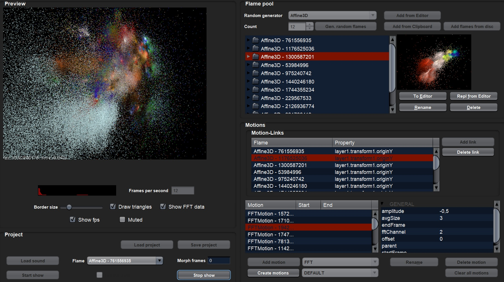

The dancing-flames-module is another experimental feature of JWildfire.
Open the Dancing flames module by selecting _Fractal flames: Dancing flames_ from the _Windows_ menu.

It allows you to create sound-synchronized animations of fractal flames in a very
sophisticated way.

What can you do:

 -  animate anything! (i.e., any property of a flame which can be accessed in the flame-editor
can be animated)
 - synchronize motion with sound (a frequency spectrum computed by a Fast Fourier Transform (FFT),
a computer algorithm commonly used to analyze sounds, can be used to link motion with "beat")
 - create motion curves (amplitude over time) for certain properties by using a spline editor or
apply a predefined motion (basing on a certain formula, like "Sawtooth")
 - group motions together (for example, have a spline-motion-curve which is slightly altered by beat")
 - watch the motion in realtime and record it to be processed again to create frames at
accurate frame rate
 - use as many fractal flames as you like in your movie and switch between them in real time during recording
 - load and save projects

=== The basic concepts
The basic concept of the animations in the dancing-flame-module is both very versatile and very simple
and contains four building blocks:

 - *motions*
 - *flame properties*
 - *motion links*
 - *motion hierarchies*.

==== Motions
You can define any number of motions, for example:

- a rotation with frequency x
- "beat" data of a certain channel from the FFT
- a manually created motion curve using the spline-editor

[.thumb]
image::images/dancing_flames_add_motion.jpg[scaledwidth=30%]

Each motion has special parameters which can be accessed through a property table. There are
some parameters which can found by all motion-types.
[.thumb]
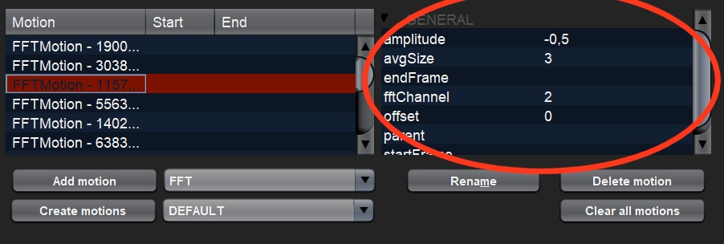

==== Flame properties
Each flame has many properties. Most of them can be easily be animated, for example:

 - camera angle
 - zoom factor of transform 2
 - Julia index of the Julian variation in the final transform.

You don't need to know all of these, they can be accessed through a tree-view in the graphical interface.
[.thumb]
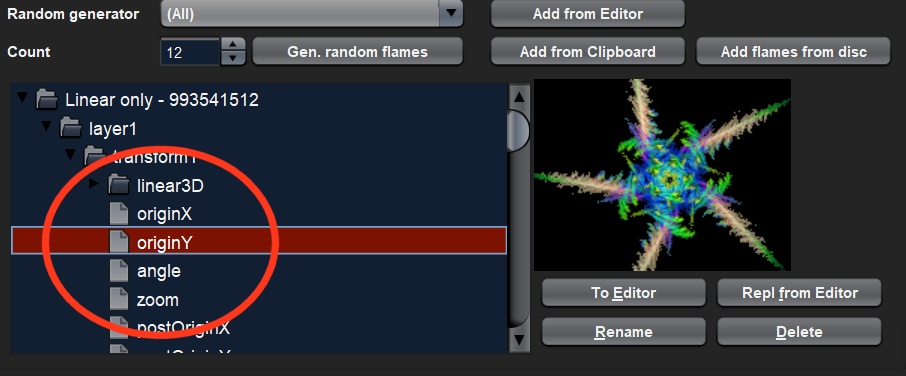

Each fractal flame has its own top-level-folder in this view. There are sub-folders for:

 - each *transform*
 - each *final transform*
 - *gradient* parameters.

==== Motion links
To actually animate a fractal flame we must connect properties to motions.
Any motion can be connected with a number of fractal properties from any flame of the project.
[.thumb]
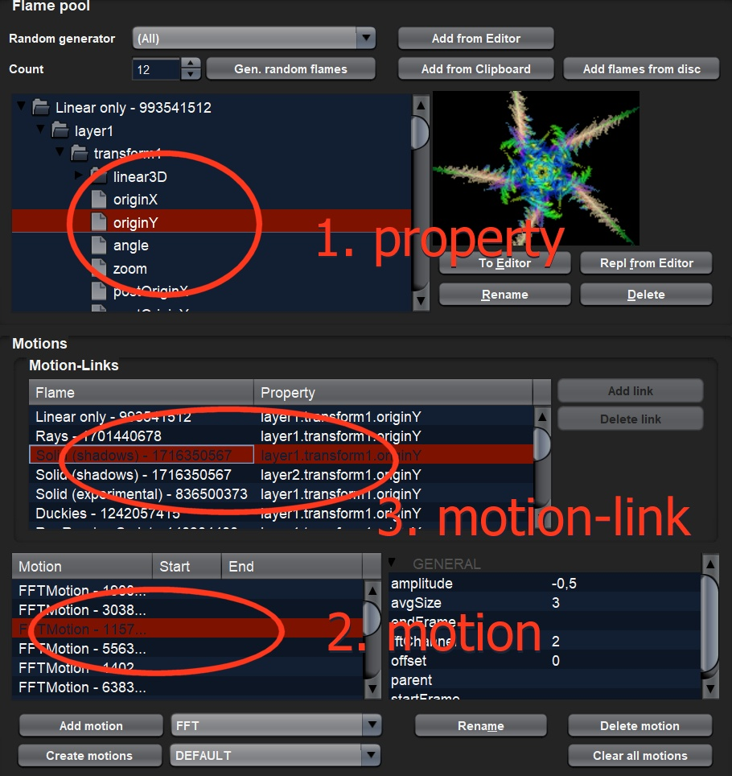

==== Motion hierarchies
In certain cases it may make sense to group motions together. For example, to have a "rougher" motion (like a
motion curve which describes a basic rotation) where a "small" motion (like "beat") is added.
To achieve this, you may choose a parent for any motion.
[.thumb]
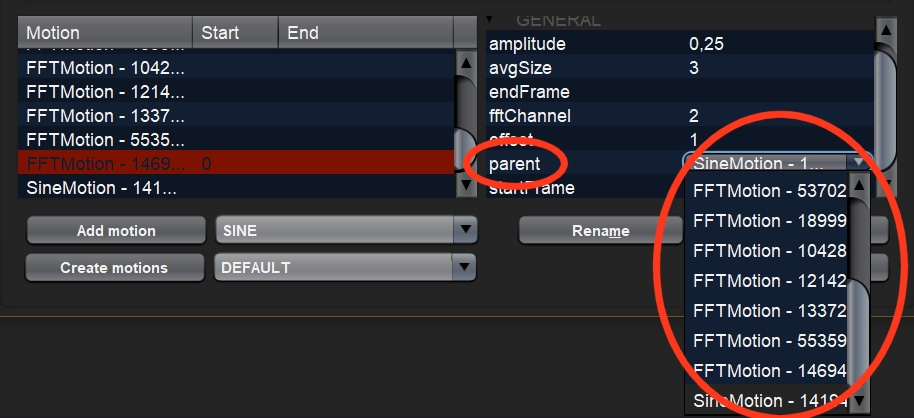

A motion having a parent can not explicitly be linked to a flame property (because it is already linked
implicitly through its parent).

=== Basic workflow
In the following sub-section a basic workflow is outlined.

==== Creating a flame-pool
The flame-pool is a collection of flames which belong to a dancing-flames-project and can all be
animated into this project. Simple projects start with only one flame in the pool, but there is no limit
and even if you have many flames in the pool, not all have to be used in the video.

There a several ways to add flames to the pool:

 - Generate a batch using a random generator,
 - import the currently load flame from the main editor,
 - add a flame from the clipboard or
 - load a batch from hard-disc.

==== Adding sound (mp3)
Sound isn't actually required to create a dancing flame project, but most projects will benefit
from the use of sound. Currently, there can only be one mp3-file for the whole project (if you want to use more
than one sound file, you have to merge them and load them as single file).
To add a sound file, just press the _Load sound_ button and choose a mp3 file.

Please note that the loading may take a while as sound is actually processed and analyzed in
the background.

==== Adjusting the project's FPS (frames per second)
The FPS setting of the project is one of the most important parameters; it affects how smooth your
animation will be and how many frames (single images) you will have to generate in order to create
the final animation.
The smoother your animation, the more data that needs to be generated and the larger the movie will become.
In my personal experience a fps value of 25 (i.e., 25 images shown per 1 second of the animation)
is a very good compromise.

==== Previewing the show
To preview the current animation press the _Start Show_ button. This will display a preview
animation and play back the sound.

In many cases the preview will not be able to follow your FPS setting. This is not a problem because the
speed of the realtime-preview is not the speed at which the final animation will be created. The final
animation is always created at the true fps setting, even for slow machines.

==== Adjusting the speed of the realtime-preview
You can improve the speed of the realtime-preview by decreasing its size.
You can do this in real-time by modifying the _border size_ slider.

==== Switching between flames during the show
You may switch between the flames of your flame pool during the show at any time.
This is currently the only interaction which is actually required to be done during the show.

This kind of interaction is absolutely intended, and will give your animation a more "spontaneous" or
"looking-alive" behavior. Just swap flames when you feel it.
To switch between flames just select them from the list-box in the project area during the show.

====  Recording a show
To record a show just enable the _Record show_ checkbox and start the show. Now any user action
(currently only switching between flames) is recorded according to your fps setting.

After finishing the show (by pressing the _Stop show_ button) you will be prompted for an output path.
Just choose a directory and specify a base-name for the flame files to be generated.

Now JWildfire recalculates the show again at the desired FPS setting and produces the flame-files which
have to be rendered later to create the movie. Depending on the length of your show and the FPS
setting, this may take a while and produce lots of files.
Please note that it is very important not to interrupt this process in order to create very accurate timing.
It's best to leave your computer alone, especially if you have a rather slow system.

==== Rendering the flames
The project, until now, was free from any output resolution settings and only fractal flames
were generated. You can render them using any resolution and quality settings later.
The recommended way is to use the <<batch_renderer, Batch renderer>> to perform final rendering.

[#batch_renderer]
== _Batch renderer_ module
[.thumb]
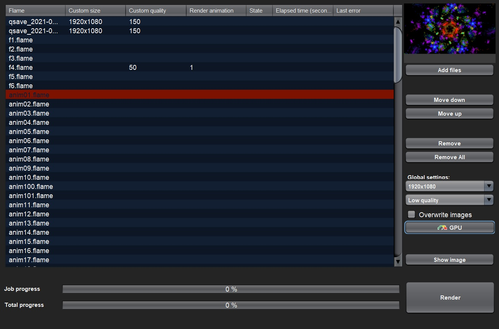

The batch renderer is designed to render fractal flames in the background (for example overnight).
Therefore it is well suited to render frames for animations or images with large resolution,
which take a while to render.
Open the Batch renderer module by selecting _Fractal flames: Batch renderer_ from the _Windows_ menu.

A special feature of the _Batch renderer_ is the area where it places the finished images.
*All images rendered by the _Batch renderer_ are placed in the same folder as the corresponding
flame-file*. This makes it easy for the _Batch renderer_ to recognize images that have already been rendered
(they are then skipped by default). This also makes it easy to pause and resume rendering.

=== _Render jobs_ table
All flames are displayed in a large table which has some editable columns:

 - *custom size*: here you can enter a custom resolution when it differs from the main
resolution selected in this window. The format is *<width>x<height>*, for example: *1920x1080*.
 - *custom quality*: here you can enter a custom quality when it differs from the main
quality selected in this window. The format is a numerical value, for example: *500* for a decent
quality level.
 - *render animation*: if you enter "1" here, JWildfire creates a whole .mp4-animation instead of
a single .png-image. You can cancel and continue this at the frame level of the animation.
When cancelling the rendering of an mp4-animation, you can continue it later at the
frame you cancelled it.

=== _Add files_ button
Here you can add a single flame or any number of flame files at once to the _render jobs_ table.

=== _Move down_ button
Flames are processed in the order they are displayed in the _render jobs_ table. By using this button
you can move the currently selected flame down one position.

=== _Move up_ button
By using this button you can move the currently selected flame up one position.

=== _Remove_ button
Remove the currently selected flame from the _render jobs_ table. This does not delete
the flame file.

=== _Remove All_ button
Removes all flames from the _render jobs_ table. This does not delete any flame files.

=== _Settings: Resolution profile_
Select the <<resolution_profiles, Resolution profile>> to be used for rendering
each entry the of _render jobs_ table.
If you want to use a different resolution for certain flames, you may override this
setting by editing the column *custom size* for the individual flames.

=== _Settings: Quality profile_
Select the <<quality_profiles, Quality profile>> to be used for rendering
each entry the of _render jobs_ table.
If you want to use a different quality setting for certain flames, you may override this
setting by editing the column *custom quality* for the individual flames.

=== _Overwrite images_ checkbox
Per default, the _Batch renderer_ will not re-render already rendered images.
You can change this by activating this checkbox.

=== _GPU_ toggle button
This toggle is only enabled when <<gpu_rendering, _GPU rendering_>> is configured on your system.
When you activate this button, all images are rendered using the _GPU renderer_.
But please be aware that this may not work well on some kind of flames and does not support all possible features.
For example, sub-flames are not supported. So, you should test it with a single flame before GPU-rendering a longer batch.

=== _Show image_ button
Loads and displays the corresponding image of the currently selected flame, if already rendered.

=== _Render_ button
Starts the rendering batch.

[#quilt_renderer]
== _Quilt Renderer_ module
[.thumb]
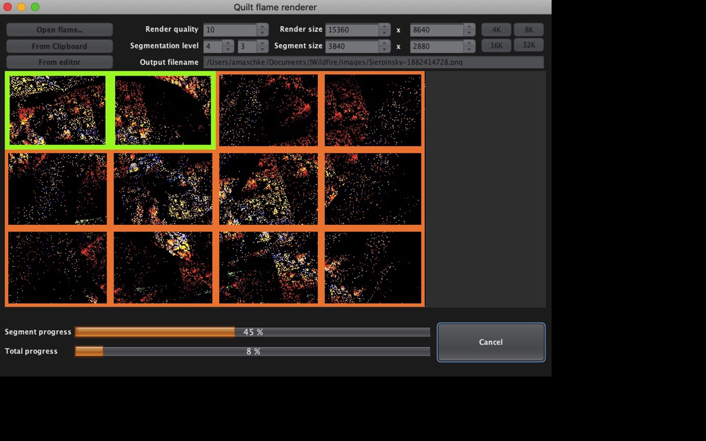

The _Quilt Renderer_ allows you to render flames of nearly unlimited size.
This works by splitting the whole image into tiles.
Open the Quilt renderer module by selecting _Fractal Flames: Quilt renderer_ from the _Windows_ menu.

You may freely specify how the tiles are generated, for example, splitting the image in 3x2 tiles or 8 vertical stripes.

Each of the rendered tiles is a valid image. So, even if JWildfire failed to assemble the tiles into one
final image (due to memory restrictions), you could perform this step using external image-processing-software,
which is more optimized to handle large images.
Images with a size up to 32K (30720x17280) were tested without any problems so far.

You can cancel/resume the rendering-process at tile-level.

Please note: Due to the nature of the fractal-flame-algorithm, the rendering of each tile may take as long as rendering the entire image.
So, this method is not efficient, but it is effective.
A 16K render on a modern computer can take about 12 hours, but you will usually get an awesome
result with endless details.

[#mesh_generator]
== _Mesh generator_ module
[.thumb]
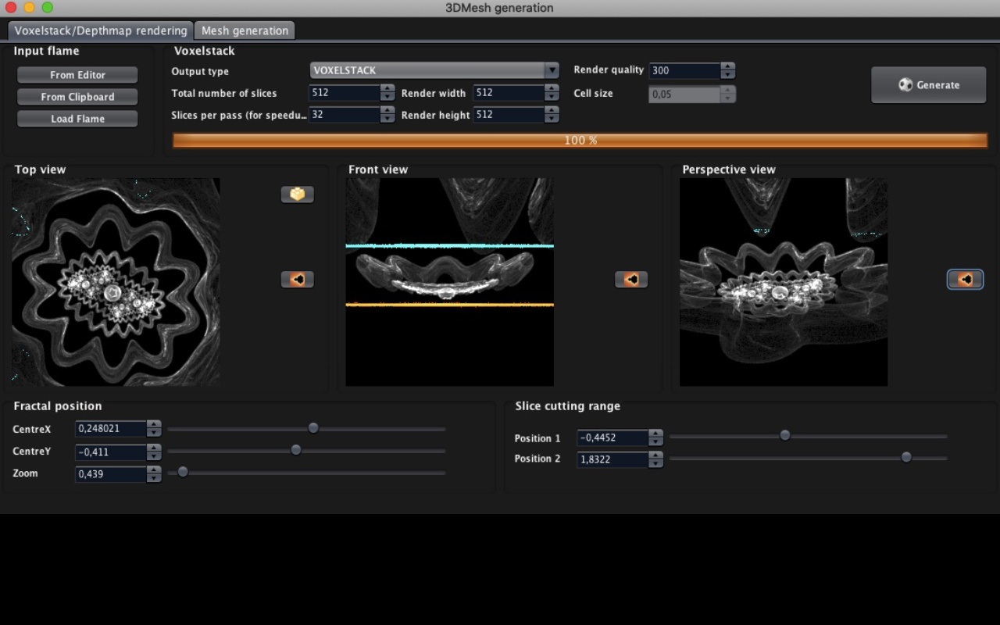
Using the _mesh generator_ you can turn your fractals into _polygonal meshes_ or _point clouds_.
Open the Mesh generator module by selecting _Fractal flames: Mesh generator_ from the _Windows_ menu.

=== Generating _Polygonal meshes_ by slicing the fractal in _Voxel stacks_
The creation of solid meshes will not work well on all types of fractals and will
require some patience and experience to get nice results.
But once you have generated a nice mesh object, you may use it in any 3D software
or even try to 3D print it.

In JWildfire the process of generating _Polygonal meshes_ requires two steps:

- creating a number of slices through the fractal. (These slices are called _Voxel stacks_
because they have both a fixed resolution (like picture elements or pixels in a image) and a certain depth.
So each slice contains pixels with a depth, which are three-dimensional pixels, called Volume elements, or _Voxels_.
And these slices stacked together build a representation of the object, hence the name _Voxel stack_.)
- building a _polygonal mesh_ from all these slices using the popular _Marching Cubes Algorithm_.

==== _Total number of slices_
Sets the number of slices to be rendered which represents the voxel resolution in the z-direction.

==== _Render width_
Sets the render resolution in the x-direction which represents the voxel resolution in the x-direction.

==== _Render height_
Sets the render resolution in the y-direction which represents the voxel resolution in the y-direction.

==== _Slices per pass_
With this setting you can improve the speed of the scanning process in a significant way but at a
cost to consumed memory.
If you have enough memory you can even set this to the _Total number of slices_
to create all slices at once.

*Please note that these three values should match the shape of the desired object.*
For example, if you have a very thin but very tall object, you may want a much higher resolution into z-direction.

==== _Generate_ (_Voxel stack_)
When the _Output type_ is set to *Voxelstack*, this will generate a batch of grayscale images
which represent the slices through the fractal (similar to the scans made by a computer tomography).

==== _Mesh generation_
Once you have finished creating a _Voxel stack_, you may create the final mesh with the _Mesh generation_ tab.

===== _From renderer_
Loads the previously rendered _Voxel stack_ without the need to select it in a file dialog.

===== _Load sequence_
Loads a previously rendered _Voxel stack_ from hard disc.

===== _Image downsample_
Downsample the slices by this factor to reduce noise. Reduces resolution, but increases quality of the mesh.

===== _Spatial filter radius_
Filter-radius used for downsampling.

===== _Brightness threshold_
Brightness level at which the object is actually seen. Increasing this value may
also help to reduce background noise, but can also lead to loss of details.

===== _Image step_
With values higher than 1 you can skip slices.

===== _Post smoothing_
When you enable this checkbox you can apply a post-smoothing effect to the generated mesh.
This is an experimental feature and is only useful on a certain types of meshes.

===== _Generate_ (_Polygonal mesh_)
Using this button you generate the final _polygonal mesh_ from the currently loaded _Voxel stack_.

=== Generating _Point clouds_
Generating _Point clouds_ it a little bit more complex internally, but much simpler from the
user's point of view. You have to only set up two parameters (_Cell size_ and _Render quality_)
and then the _Point cloud_ can be generated in one step.

==== Cell size
This is the most important parameter for generating _Point clouds_. It affects both memory consumption
and resolution of the final result. It represents the minimum absolute voxel size which can be filled
with information.
The smaller the _cell size_, the more voxels are generated and the more processing time is required.
Voxels are generated at two levels:

 - *raw voxels*: represent a result of a fractal iteration. Are generated at a scale of billions.
 - *final voxels*: represent a kind of _average_ of all _raw voxels_ in a cell of _cell size_.

The smaller the _cell size_, the more calculations are needed to create final voxels, and the
more memory is required to temporarily hold _raw voxels_.

*Please note that the influence of this parameter is cubic.*
For example, halving it causes an increase of effort by a factor 2 in 3 dimensions,
reaching a total factor of 2 X 2 X 2 = 8. As a comparison: it is like increasing
screen resolution, but into three directions instead of two.

==== _Generate_ (_Point cloud_)
When the _Output type_ is set to *Point cloud*, this will generate a _Point cloud_ in *.ply*-format.
You may process/view such files for example in _Houdini_ or _Meshlab_.

=== General options

==== _Output type_
There are two options:

 - *Voxel stack*: create a _Voxel stack_ as the first step of generating a _polygonal mesh_
 - *Pointcloud*: create a _point cloud_ in one step

==== _From Editor_
Transfers the currently edited fractal flame from the _Main Editor_ to the _Mesh generator_.

==== _From Clipboard_
Loads a fractal flame from the _Clipboard_ into the _Mesh generator_.

==== _Load Flame_
Loads a fractal flame from an external file into the _Mesh generator_.

==== _Fractal position_
This area contains controls to set the position and size of the fractal flame for
the scanning process. Any portions which are outside of the preview will not
be scanned and therefore will not be part of the generated mesh.

===== _CentreX_
Moves the fractal in the x-direction.

===== _CentreY_
Moves the fractal in the y-direction.

===== _Zoom_
Scales the fractal.

==== _Slice cutting range_
Here you set the start- and end-position of the scanning process in the z-direction.
Any portions of the fractal which are outside of this range will not
be scanned and therefore will not be part of the generated mesh.

===== _Position 1_
Sets the start position in the z-direction for the scanning/slicing process.

===== _Position 2_
Sets the end position in the z-direction for the scanning/slicing process.

Hint: the order of _Position 1_ and _Position 2_ does not matter, you may have _Position 1_ at
the top or at the bottom depending on your personal preference.

==== _Render quality_
This sets the render quality for scanning the fractal.
Optimum values highly depend on the type of fractal.
Solid fractals usually need a high number of samples to be really clean.
Values in the range of 300 to 2000 are typical.

[#gpu_rendering]
== _GPU render_ module
[.thumb]
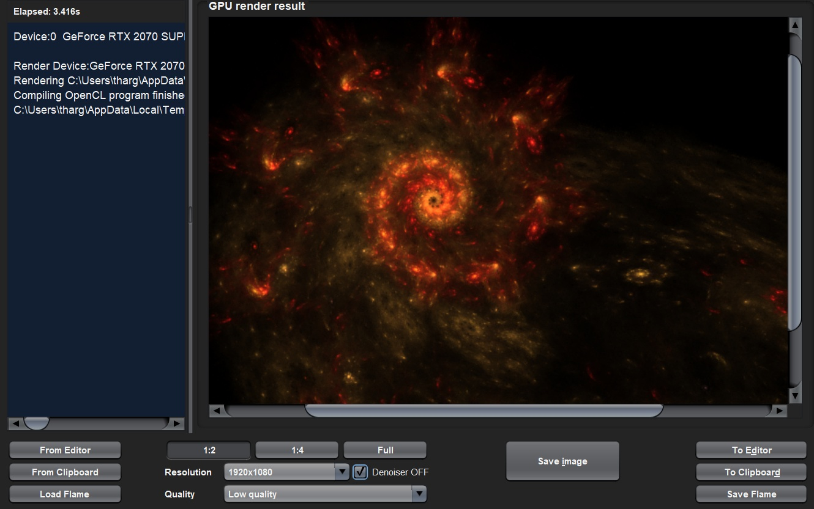

GPU rendering in JWildfire is enabled by integrating FAEngine, a GPU-rendering-engine
created by Steven Brodhead.
In JWildfire 7.0, GPU-rendering was re-implemented in a fundamental way:

- It is still using FAEngine as GPU-gateway, but most of the GPU-code is actually JWildfire-specific
- Most of the actual GPU code is provided by JWildfire during runtime and compiled and executed during FAEngine on the GPU
It would be impossible to create a variation set which contains all GPU-supported variations.
They would be too many, and compilation at the device would fail or even crash the whole system.
Therefore, JWildfire always sends only the code to FAEngine which is actually required.
This makes the rendering startup for each flame a little bit slower (and does not allow for a realtime-display),
but actually works very good and reliable)
- uses a special binary (FARenderJWF) and and custom kernel which already provides many of JWildfire's features
- only this gives actual control over the behaviour of variations and allows us to implement features which are not supported naturally by FAEngine

=== Currently supported features:
- support for about 550 variations (of a total of 850)
- motion blur
- some of the additional color balancing options
- 3d-affine-transformations ("XY"-, "YZ"-, "ZX"-buttons)
- weighting fields
- custom variations

=== Currently not supported:
- layers
- local gamma effects
- solid rendering

=== Supported platform
The new solution is using CUDA instead of OpenCl, so AMD devices are no more supported.
I had to choose between supporting more devices or supporting more possible features (and a better developer speed),
therefore I switched to CUDA.

So, GPU-rendering is currently only supported on Windows 10 and requires a CUDA-capable graphics card.

For example: NVIDIA 1060 or better will work very well. This card is also the minimum requirement
which is supported from my side.
So, when you have an card which is older, it may also work, but when not, I can not help you with it.

=== Note about Performance
Please note: the more features you use in your flame, the more code is created, compiled and executed.
Especially, weighting-fields are very expensive in comparison to other features.
At higher resolution the GPU render will always be faster - MUCH faster.
But, it is possible, that a small preview on GPU takes more time than a CPU render.
This is due to the complicated process to invoke a GPU render (while a CPU render can start
instantly at every time).

=== Installation/Automatic Self-test/Troubleshooting
In comparison to previous versions there is no separate installation required nor possible.
Everything, which is required from the side of JWildfire, is already included and installed.
(What is not included, is for example the driver for your graphics card.)

A self-test is performed at the startup of JWildfire. When the self-test passed, you will see two "GPU"-buttons in the left of the preview
area inside the main editor.

When you do not see the buttons, but meet the system requirements, please check if you have the latest NVIDIA drivers
for your device. This actually seems to solve about 90% of the problems I have seen so far.

=== Rendering flames using the GPU
==== GPU renderer module
There is a separate "GPU renderer"-window to explore GPU rendering. This window works similar to the
Interactive renderer; you may import flames from the editor or load them from your hard disk.

In this window, you will be able to see the exported GPU-code. And you will get the most detailled information messages,
compared to all other places where also GPU-rendering is supported

==== Main editor
When you have activated the <<gpu_mode, GPU-mode>> inside the main-editor, all rendering is done automatically using GPU.
This applies also to the rendered preview (the button at the lower right corner of the preview-area), but not to the real-time-preview
which is used for editing.

==== Batch rendering
When GPU-rendering is available at your system, a "GPU" button will appear in the <<batch_renderer, Batch-renderer>>.
You may use it to render whole batches using the GPU.
But, before you render a huge sequence, you should be sure that the flames do not use
features which are not supported by GPU-rendering (for example: sub-flames).
You may quickly do so by transferring one of the flames to the "GPU renderer" window and see if it works.

[#iflames_module]
== _IFlames_ module
[.thumb]
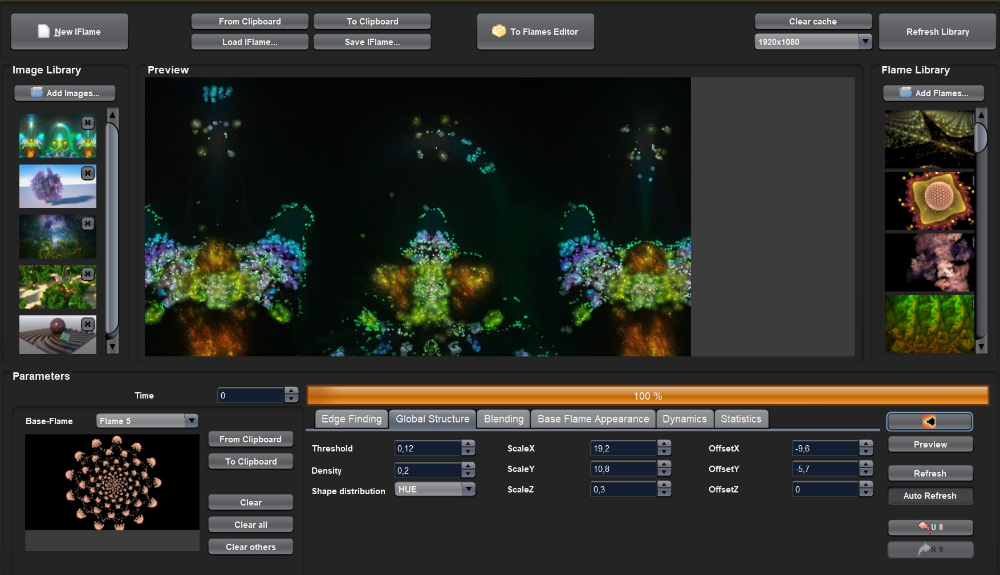

This is an experimental application which combines particle simulation and fractal flames.

It requires a rather powerful computer, especially when you want to animate the iflames.

There are about 350 parameters to change, many of them may be animated:

- *Edge-finding*: controls where to place base-shapes
- *Global structure*: controls the global structure of the resulting iflame
- *Blending*: controls coloring
- *Dynamics*: controls global settings affecting dynamics aspects, like gravity
- *Base Flame Appearance*: controls the base-shapes inside an iflame (you may have up to 6 different base-shapes)
- *Size and orientation*: The size and orientation of the base-shapes
- *Distribution*: how to place which base-shape
- *Blending*: local coloring
- *Mutations*: controls how to create mutations from the base-shapes
- *Dynamics*: dynamic properties (like speed in a certain direction) of base-shapes

[#preferences]
== _Preferences_ window
[.thumb]
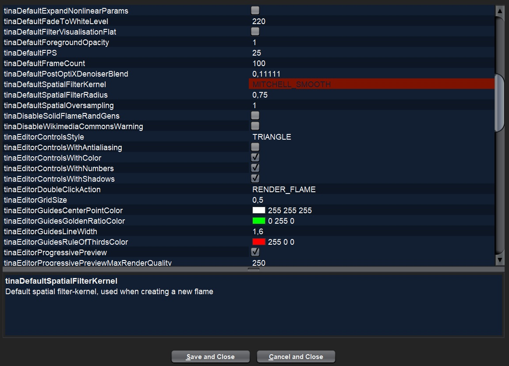

In the _Preferences_-window you may customize JWildfire to your needs.
Open it by choosing _Preferences_ from the _Settings_ menu.

The customizable properties are key-value pairs which are displayed in one large table.
You may edit a property by double-clicking the value in the 2nd column of the table.

Each property has a small description which is displayed at the bottom of the window.

[.thumb]
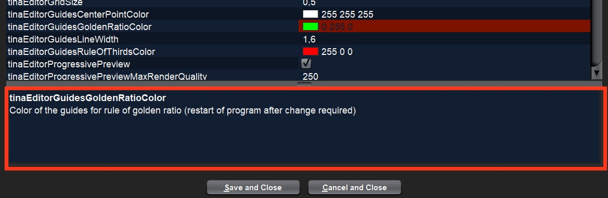

Depending on the type of parameters, there are special parameter-editors available.
You reach them by double-clicking the value in the 2nd column of the table. For example:

 - for color-parameters a color-selection-dialog is available.
 - for folder-parameters (for example, to select the gradient-folder) you can both enter
the folder manually or select the folder using folder-dialog.

[.thumb]
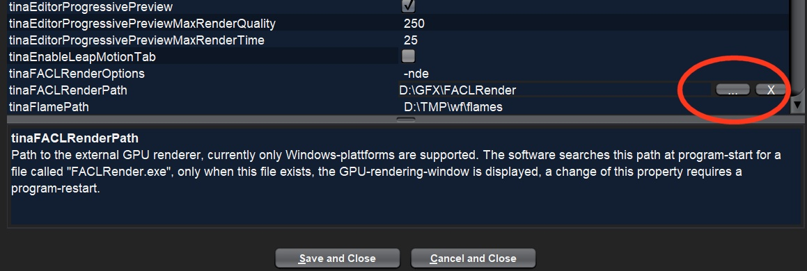

Some properties may be changed "on the fly", while others will need a restart of JWildfire in order
to show an effect. This is usually mentioned in the description of the property.

[#platform_specific_topics]
== Platform-specific topics (Windows, Mac, Steam, ...)
In this section some platform-specific topics are covered. Even though JWildfire is widely
platform-independent, there are features which are not available on certain platforms.
Also discussed are options for customizing the startup of the application which must
be specified in different ways, depending on the platform.

[#jvm_startup_parameters]
=== Startup options
In some cases it is necessary to set up some startup parameters for the application.
Some common examples are:

 - increase the <<max_mem, maximum amount of usable memory>> (to be able to render in higher resolutions)
 - increase the overall <<ui_scale, UI-scale>> (which may be too small on 4K monitors))
 - fix some <<ui_glitches, UI-glitches>>

The location of these parameters differs depending on the platform.

==== Steam Edition
Currently, you must edit these parameters after each update.
To simplify this, there is a shortcut inside JWildfire to open the correct file.
It is located under _Settings -> Startup settings (Steam)_.

When you click at this menu-item, it should open the file *<SteamApps>\common\JWildfire\app\JWildfire.cfg*
(When this does not work due to missing permissions, you may also open and edit this file manually).

Please see the sub-section <<jvm_settings_example, _Example (for both _Steam_ and _Mac_ version)_>> for an example.

==== App Store Edition
Currently, you must edit these parameters after each update.
These parameters are inside a file named JWildfire.cfg inside the application folder.

To edit this file you must open the _Finder_ and locate the application _JWildfire_ inside the _programs_ folder.
Right-click on the entry _JWildfire_ and select the option *Show Contents*. This will show the files
which belong to the application. Navigate to the sub-folder _Contents/app_ and you should see the file
_JWildfire.cfg_ inside this folder. You must edit this file in order to change the startup-parameters.

Please see the next sub-section <<jvm_settings_example, _Example (for both _Steam_ and _Mac_ version)_>>
for an example.

[#jvm_settings_example]
===== Example (for both _Steam_ and _Mac_ version)
Once you edit the file _JWildfire.cfg_, it works the same for both the _Steam_ and the _Mac_ platform.

The file contains different sections, the _startup JVM parameters_ for JWildfire must be placed
under the section *[JavaOptions]*.

Example file:

[source]
----
[Application]
app.name=JWildfire
app.version=6.40
...

[JavaOptions]
-splash:app/splash.png
-Xmx8G

[ArgOptions]
----
Here you see that under *[JavaOptions]* there is an entry *-Xmx8G*. This specifies the maximum
usable memory. The default is *8G*, which means 8 gigabytes of memory.
If you want to increase this to 32 GB, you just would change the line to:
[source]
----
...
[JavaOptions]
-splash:app/splash.png
-Xmx32G
...
----

*Please note that JWildfire will not start when this value exceeds the actual free memory at the time you start JWildfire*

=== Restrictions
==== Steam Edition (Windows only)
There are no restrictions. The Windows-based version of JWildfire currently has the richest feature set.

==== App Store Edition (Mac only)
On the Mac platform there are the following restrictions:

- the JWildfire-specific file-dialogs can not be used due to security-related requirements,
instead the macOS-native dialogs are used. This is not bad, because it provides the typical behavior under macOS,
but there are some features that you will only find in JWildfire-specific file dialogs. These features are not
available on the Mac platform.
- <<ai_based_denoiser, AI-based denoisers>> are not supported.
- <<gpu_rendering, GPU rendering>> is not supported.
- LeapMotion-controller-support is not available.

==== Linux Version
There is no special Linux version, but the free version from the official website https://jwildfire.overwhale.com
does also work on Linux. To make it work, you must install a Java Virtual Machine (JVM).

Then there are the following restrictions:

- <<ai_based_denoiser, AI-based denoisers>> are not supported.
- <<gpu_rendering, GPU rendering>> is not supported.
- LeapMotion-controller-support has not been tested, but probably will not work.

== FAQ (frequently asked questions)
Here are answers to some popular questions which I get very often. They did not fit well into
the other chapters, so I collected them in this section.

[#max_mem]
=== JWildfire does not use all my memory to render images at large resolutions
Due to its nature, JWildfire uses a fixed setting for the maximum memory it can use.
The default setting for this value is 8 GB.
When this limit is too low for you to render images at your desired resolution,
you can increase this value. To achieve this, you have to modify the JVM parameter *Xmx*.

For example, to increase the value to 32 GB, you should change the *Xmx*-value in the _JWildfire.cfg_ like this:

[source]
----
--Xmx32G
----

You can also decrease the value, if you want to use less memory.

*Please note, that JWildfire will not start when this value exceeds the actual memory available.*

It is not recommended to use higher than necessary values as this will degrade performance slightly.

Please see the sub-section <<jvm_startup_parameters, Changing JVM startup parameters>> to see
how this file can be edited.

[#ui_scale]
=== The UI scale is microscopic (after an update)
Currently, the UI-scale must be set after each update.
You can increase the UI scale by changing the startup parameter *sun.java2d.uiScale*, for example:

[source]
----
-Dsun.java2d.uiScale=1.65
----

Please see the sub-section <<jvm_startup_parameters, Changing JVM startup parameters>> to see
how this can be achieved.

[#rendering_in_4k]
=== Are 4k renders possible?
Yes.

You can literally render in any resolution, also 8k:

- by rendering a single image at once. The maximum render size is limited only by your available memory.
(For really huge images, you may need patience too.)
- by using the <<quilt_renderer, _Quilt-renderer_>>-module you may render really huge images in smaller parts,
which are then assembled together. The maximum render size is also limited by memory. But often, you will
get other problems before reaching the memory limit in JWildfire. For example, some image files can
be very big (I have tested with sizes up to 1 GB), and it is hard to find software that can process such large images.

=== Can I render images with removed/transparent background?
Yes, you can.

See the properties _Background transparency_ and _Fg opacity_ at the _Coloring_-tab.

You can also preview the rendering with transparent background. Set the _Display/hide transparency_ - button
at the preview-area.

=== How to save a flame as an image?
You can not directly save a flame as an image. You must _render_ a flame in order
to generate an image. There are multiple options you can specify for rendering (for example: the output resolution)
which may allow you to get different images out of one fractal flame.

=== Is it possible to render flames at higher resolutions than inside JWildfire?
There are no restrictions regarding render size which must be resolved by an external
application for rendering. The only limitation is memory.
See <<rendering_in_4k, Are 4k renders possible?>> for more information.

[#ui_glitches]
=== How to fix glitches/weird behavior of the UI
Some users have reported weird behavior of the UI:

- for example, one window overwriting the content of another
- or windows following the mouse pointer

It seems that this is caused by some misconfiguration of
_DirectDraw_-acceleration of Java2D (maybe a driver issue).

The known solution is to switch to _OpenGL_-acceleration or turn _DirectDraw_ off.

==== Option 1: Enable _OpenGL_
set the following _JVM parameter_:
[source,java]
----
-Dsun.java2d.opengl=True
----

(the uppercase T is correct)

==== Option 2 (if option 1 does not work): Disable _DirectDraw_
set the following _JVM parameter_:
[source,java]
----
-Dsun.java2d.noddraw=true
----
(the lowercase t is correct)

*Please note that only one of these _JVM parameters_ should be set at the same time.*

The location of these _JVM Parameters_ is platform-specific.
Please see the section <<platform_specific_topics, _Platform-specific topics_>> for more information
about changing _JVM Parameters_.
